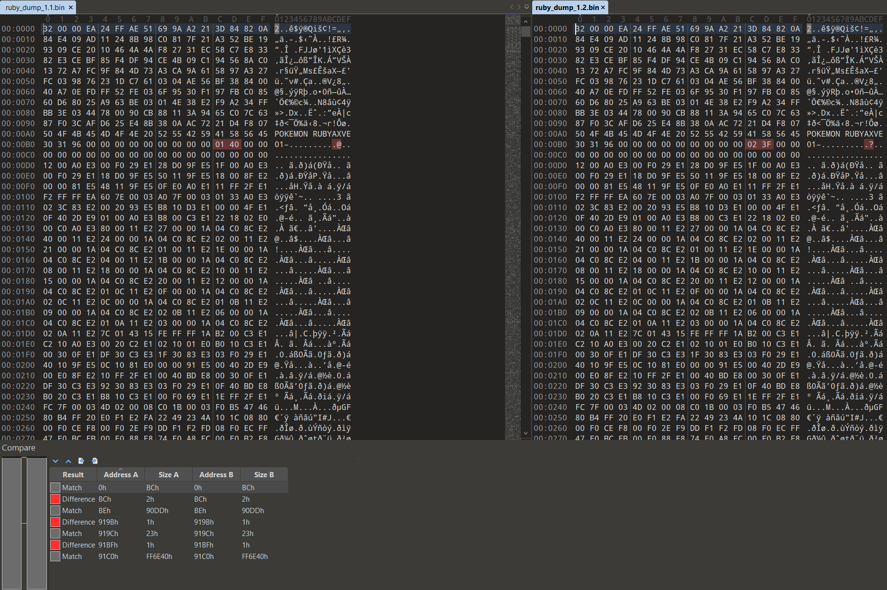
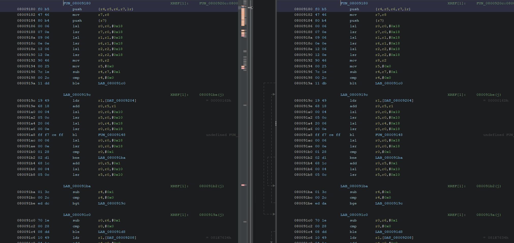
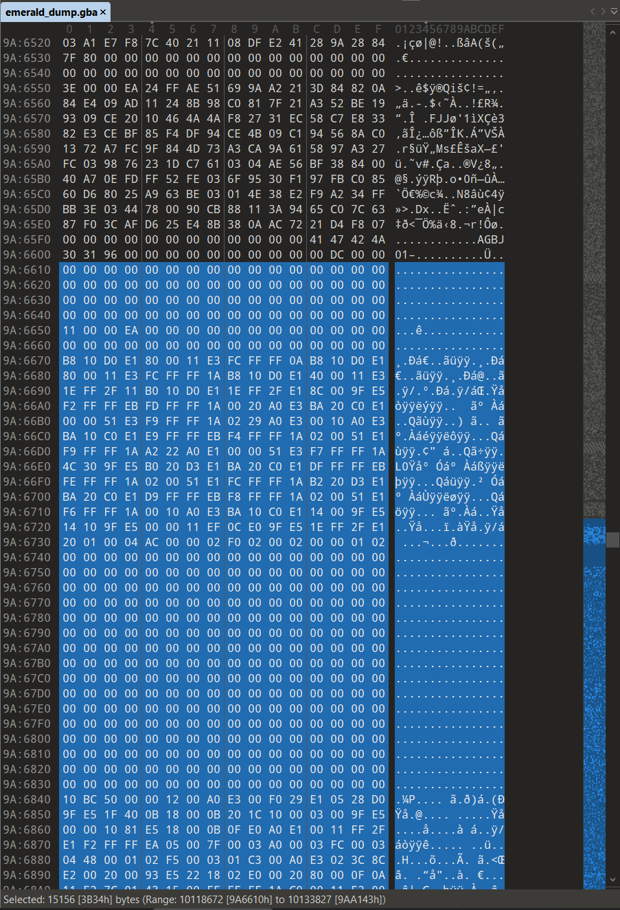
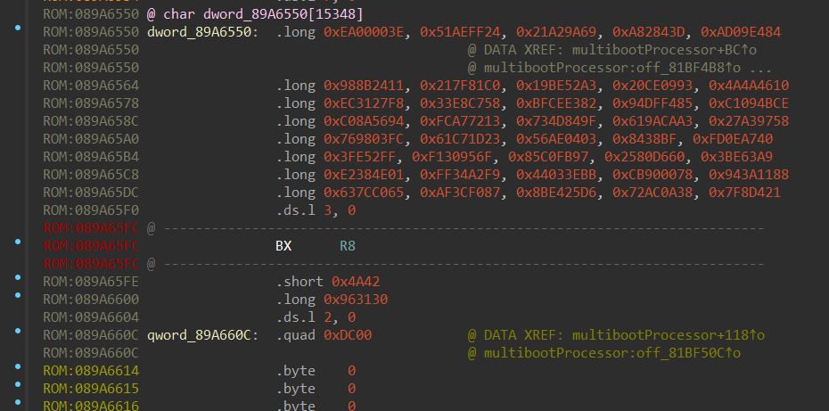
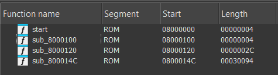
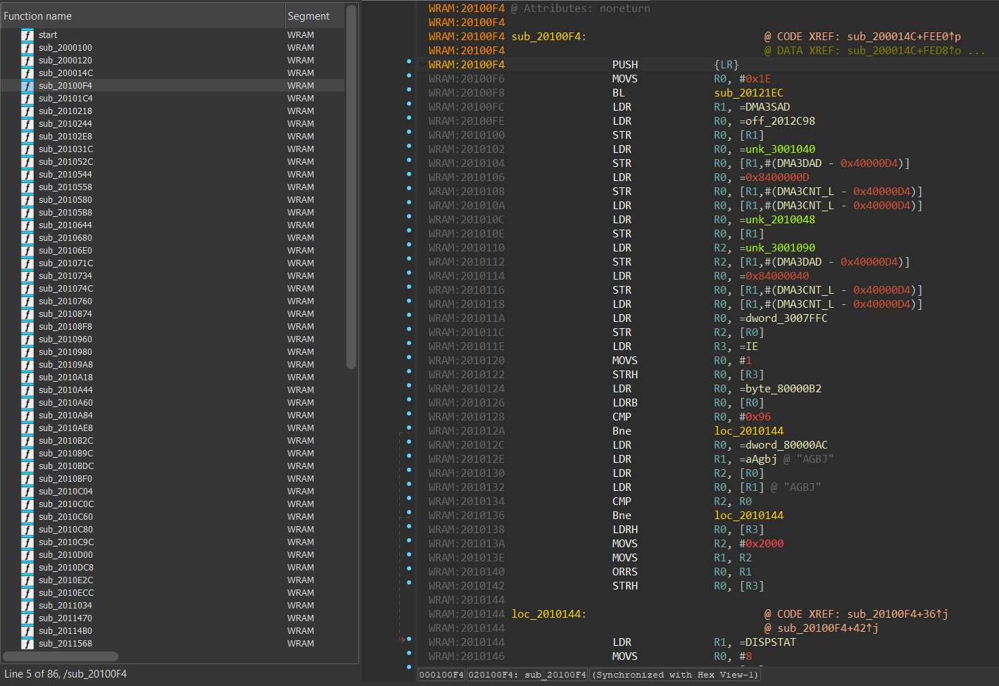
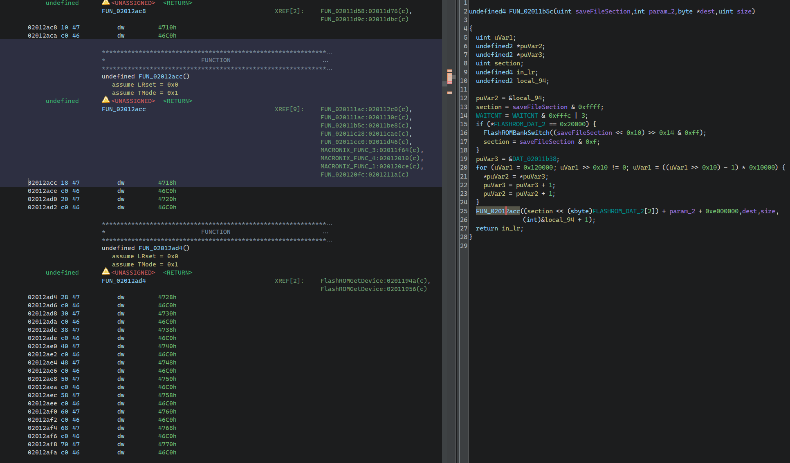
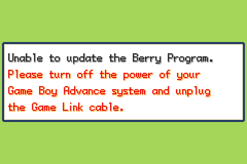
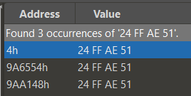

Recently, I learned that Pokémon Ruby and Sapphire were affected by a clock-related bug. After 366 days of gameplay, clock-based events ceased to function, as if time had stopped. If a player waited one year after the bug began, it would actually fix itself. Even more interesting to me was that a number of Pokémon games released after Ruby and Sapphire included a "Berry Program Update" that could be sent to the Ruby or Sapphire game cartridge to fix this bug either before it happened or while it was happening. I had searched online for more information, but the few explanations of the bug and the Berry Patch that I did find weren't technical enough for my liking. On the other hand, I didn't look too hard for explanations because I wanted to explore it myself. Let's get started!

# What Happens
On Nintendo's official website, they state:

> In Pokémon Ruby and Pokémon Sapphire, certain berry trees will stop producing berries after you've played your game for one year. All main game play activities, such as collecting and battling Pokémon, are not affected. If you want to keep the berries growing after a year of game play, please use the information below to find out how to update your game pak.

[Bulbapedia](https://bulbapedia.bulbagarden.net/wiki/Berry_glitch#Explanation) has a lot more information:
> The game cartridge contains a real-time clock (RTC) which keeps track of the year, month, day, hour, minute, second, and day of the week. When the RTC is first turned on, its date is set to January 1, 2000. Because the game has no need for an actual calendar system, it converts the RTC's year, month, and day data into a single "day number". The conversion function has a flaw, however: it will only count years (adding 365 or 366 days for each year or leap year) starting from 2001. So, while the RTC clock is reporting the year as 2000 or 2001, in both cases, the conversion equates this to "add 0 days to the day number". This means that, for the first 366 days the RTC runs (starting from January 1, 2000), the game's day number will count from 1 to 366 normally, but when the RTC clock reports January 1, 2001, the game's day number will start from 1 again.  
If, for example, a Sitrus Berry was planted on December 31, 2000 according to the RTC, which the game interprets as day 366, it will be scheduled to be fully grown on day 367. Due to the glitch, day 367 will not happen until the RTC reaches January 2, 2002. The result is that the growth of the Berry appears to be frozen for 366 days. Other effects of this glitch include:  
    - Random events which are calculated once per day, including the random number for Mirage Island and weather conditions on Route 119 and Route 123, along with random events which must be announced on TV, such as the Energy Guru and Lilycove Dept. Store sales and service days at the Mauville Game Corner, will be frozen until 366 days after the game was last played before the glitch took effect.  
    - Drawings at the Pokémon Lottery Corner, NPCs who offer free Berries daily, and the man in Pacifidlog Town who gives TM27 (Return) or TM21 (Frustration) weekly will be frozen until 366 days after these events were last used.  
    - The number of successful rocket launches at the Mossdeep Space Center will be reset to 1.  
The glitch does not affect the Evolution of Eevee into Espeon or Umbreon or the tides in Shoal Cave because these events are based only on the current time, not the day number. 

Given this, let's lay out the facts:
- The cartridge contains a real time clock (RTC) which initializes itself to January 1, 2000, and continues counting upwards until it loses power or is set otherwise
- Ruby and Sapphire store a day number in the save file which is used to determine if a day has elapsed
- Ruby and Sapphire have a flaw in this day number calculation that effectively treats 2000 and 2001 as the same year (+0 days)

An interesting observation here is that any cartridge that hasn't had its battery replaced (and still works) is safe - but it's not a very good idea, considering that if you do replace the battery after beginning a new save, you will have to wait the difference between Jan 1, 2000 and the date of your last save in order for daily events to work again. If you truly would like to play Ruby or Sapphire on a game cartridge these days, it would be best to replace the battery prior to beginning your adventure.

# Surface Level
There are a number of ways to fix the bug in any given Ruby or Sapphire cartridge. From [Bulbapedia](https://bulbapedia.bulbagarden.net/wiki/Berry_glitch#Fixing_the_glitch), you can patch via Pokémon FireRed, LeafGreen, Emerald, Pokémon Colosseum/XD, Pokémon Channel (PAL only), Pokémon Box, e-Reader (Japan only), a GameCube Demo exclusive to retailers, a GBA cartridge exclusive to retailers, or, finally, sending your cartridge directly to Nintendo, a service which they discontinued in 2012. I'd like to take a look at the patch provided by Pokémon Emerald, see how it works, why it works, and what it does in different scenarios.

## Getting an Emulator Ready
There are a number of modern emulators with high accuracy and functionality that mimic what's required to perform the Berry Patch, or "Berry Program Update", as Nintendo/Game Freak call it (I will refer to it as Berry Patch from here on). I attempted to perform the update with VisualBoyAdvance, but I could not get the emulator to transfer the Berry Patch to the 2nd emulated GBA. Thankfully, this did work on the mGBA emulator. The steps are as follows:
- Obtain mGBA. I used 0.10.5
- Obtain a GBA BIOS file. This is required, as the berry program transfers during the GBA BIOS startup. Set the BIOS file in mGBA
- Start mGBA, and select "File > New multiplayer window", which will open a new window
- In the original window, start Pokémon FireRed/LeafGreen/Emerald
- In the second window, start Pokémon Ruby/Sapphire
- Let both games get to the title screen
- On Emerald, press SELECT + B at the same time. You can press A through the rest of the screens
- On Ruby, press START + SELECT and hold them down, then press CTRL + R (or your Reset hotkey) while still holding down START + SELECT
- FR/LG/E should be showing a "transmitting" screen, and R/S should be showing a flashing Nintendo logo beneath the GAME BOY text
- Finally, R/S should show text stating "The Berry Program Update will now begin..."

It's important to note that your save slot depends on which "player" your emulator is. When you open a multiplayer window in mGBA, "player 1" is the first window, and "player 2" is the second. These are different save slots. If you open mGBA, run through the opening scene, save, and then perform the above steps, your save file will only be recognized by the mGBA that is actually running FR/LG/E at the time. The second mGBA instance (player 2) will not recognize a save file at all.

So what are the different scenarios?

| Save Date        | RTC Date of Patching  | Berry Patch Output | RTC Date Set To |
| ---------------- | --------------------- | ------------------ | --------------- |
| No Save          | N/A                   | "Unable to update Berry Program." |
| 2000-01-01 (1)   | 2000-01-01 (1)        | "Your Berry Program has been updated." | 2001-01-01 (1)
| 2000-06-01 (153) | 2000-06-01 (153)      | "Your Berry Program has been updated." | 2001-06-02 (153)
| 2000-06-01 (153) | 2001-06-01 (152)      | "There is no need to update your Berry Program." | N/A
| 2000-06-01 (153) | 2000-03-01 (61)       | "Your Berry Program has been updated." | 2001-03-02 (61)
| 2000-06-01 (153) | 2001-03-01 (60)       | "There is no need to update your Berry Program." | N/A
| 2000-06-01 (153) | 2000-01-15 (15)       | "Your Berry Program has been updated." | 2001-01-15 (15)
| 2000-01-15 (15)  | 2000-01-15 (15)       | "Your Berry Program has been updated." | 2001-01-15 (15)
| 2000-01-15 (15)  | 2001-01-10 (10)       | "There is no need to update your Berry Program." | N/A
| 2000-01-15 (15)  | 2001-01-15 (15)       | "There is no need to update your Berry Program." |
| 2000-01-15 (15)  | 2001-01-20 (20)       | "There is no need to update your Berry Program." |
| 2000-12-15 (350) | 2000-12-15 (350)      | "Your Berry Program has been updated." | 2001-12-16 (350)
| 2000-12-15 (350) | 2000-12-31 (366)      | "Your Berry Program has been updated." | 2002-01-01 (732)
| 2000-12-15 (350) | 2001-01-01 (1)        | "There is no need to update your Berry Program." | N/A
| 2000-12-15 (350) | 2001-01-15 (15)       | "There is no need to update your Berry Program." | N/A

*Note that the day value next to the date is how the code in Pokémon Ruby interprets the date into a single number, as described above.*

I think I've seen enough. Honestly, it looks like a basic update, where `if year == 2000: day += 366`. This is surprising to me, as Bulbapedia claims:

> If the game is already affected by the Berry glitch, these programs will set the RTC forward to January 2, 2002, the date at which all effects of the glitch end.

Does the fix check for active berries or something? If it does, why does it update saves in 2000 to 2001? If it doesn't, then why doesn't it update 2001 saves with a lower day value to some later date? These last few scenarios are really surprising to me. You're telling me I could get into a situation where I saved ~360 days into a game's RTC becoming active, and if I don't apply the Berry Patch within the next *few weeks*, I'm locked out of berry events for almost a year? Even with the "fix"? And why did we never observe the "January 1st, 2002" behavior Bulbapedia described? Now I'm really interested.

# HM08'ing Deeper

There's a few things I neglected to explain above, because anything from here on out is going to get far more technical.

In order to actually investigate this, I've been using the mGBA emulator. At first, I was very curious as to how this fix worked. When I heard about it initially, I was thinking there was some kind of binary patch applied to the game to actually fix the logic. The above references to Bulbapedia cleared that up immediately, though, and specified that the fix took place by modifying the real-time clock on the game cartridge itself. When it comes down to it, a lot of games didn't use a real-time clock. The ones that did surely didn't often, if ever, set that real-time clock. For example, when you set the clock upstairs at your house in R/S/E, the game simply uses that as a baseline for future timed events like Shoal Cave which rely on a specific time of day; it doesn't set the RTC's time to the provided value.

So as an emulator developer, what makes the most sense? Do you emulate the bespoke behavior of starting at 2000-01-01 and counting up indefinitely from there somehow like a real cartridge would? Or do you just use... the real-time clock... built into the device you're running the emulator on? Let's say you're using the user's computer as the source for the RTC. What happens when a game writes to the RTC? You obviously can't (or shouldn't) write to the user's computer's date and time. mGBA handles this by ignoring RTC writes entirely.

While mGBA does have custom RTC settings that I could use, I only learned about them after writing this entire post. So I used a great piece of software called RunAsDate which runs a program as if it's a certain date you specify, which works as expected on mGBA. Now that I can save on certain days and run the Berry Patch on others, the next thing we need is a way to figure out how to see what the Berry Patch is doing to the RTC.

Many hours, one S3511A datasheet, many comments to ensure I'm still sane, a few changes and a lot of logging later, I have some adjustments to the mGBA source that will log input commands just as it logs output commands:

<!-- mGBA Diff -->
```diff
index eb5328346..fff5d3b03 100644
--- a/src/gba/cart/gpio.c
+++ b/src/gba/cart/gpio.c
@@ -137,42 +137,59 @@ void _outputPins(struct GBACartridgeHardware* hw, unsigned pins) {
 
 void _rtcReadPins(struct GBACartridgeHardware* hw) {
        // Transfer sequence:
+       //   SCK SIO  CS
        // P: 0 | 1 |  2 | 3
-       // == Initiate
-       // > HI | - | LO | -
-       // > HI | - | HI | -
-       // == Transfer bit (x8)
-       // > LO | x | HI | -
-       // > HI | - | HI | -
-       // < ?? | x | ?? | -
-       // == Terminate
+       // == Initiate - step 0, CS lo -> hi
+       // > HI | - | LO | - | 1
+       // > HI | - | HI | - | 5
+
+       // == Transfer bit (x8) - step 1, SCK lo -> hi
+       // > LO | x | HI | - | 4 = 0 bit, 6 = 1 bit
+       // > HI | - | HI | - | 5
+       // < ?? | x | ?? | - |
+
+       // == Terminate - CS low
        // >  - | - | LO | -
+
        switch (hw->rtc.transferStep) {
        case 0:
+               // SCK HI
                if ((hw->pinState & 5) == 1) {
                        hw->rtc.transferStep = 1;
                }
                break;
        case 1:
+               // SCK, CS HI
                if ((hw->pinState & 5) == 5) {
                        hw->rtc.transferStep = 2;
+               // CS LO - abort
                } else if ((hw->pinState & 5) != 1) {
                        hw->rtc.transferStep = 0;
                }
                break;
        case 2:
+               // if SCK lo - read bit
                if (!(hw->pinState & 1)) {
+                       // empty the msb we haven't yet read
                        hw->rtc.bits &= ~(1 << hw->rtc.bitsRead);
+
+                       // read the new bit from SIO and shift it into the correct position
                        hw->rtc.bits |= ((hw->pinState & 2) >> 1) << hw->rtc.bitsRead;
+               // if SCK hi -
                } else {
+                       // CS hi, communication is not done
                        if (hw->pinState & 4) {
+                               // the current command is a write command OR command is not set
                                if (!RTCCommandDataIsReading(hw->rtc.command)) {
                                        ++hw->rtc.bitsRead;
-                                       if (hw->rtc.bitsRead == 8) {
+                                       if (hw->rtc.bitsRead % 8 == 0) {
                                                _rtcProcessByte(hw);
                                        }
+                               // the command is a read command
                                } else {
+                                       // set output pins for game to read
                                        _outputPins(hw, 5 | (_rtcOutput(hw) << 1));
+
                                        ++hw->rtc.bitsRead;
                                        if (hw->rtc.bitsRead == 8) {
                                                --hw->rtc.bytesRemaining;
@@ -183,6 +200,7 @@ void _rtcReadPins(struct GBACartridgeHardware* hw) {
                                                hw->rtc.bitsRead = 0;
                                        }
                                }
+                       // CS lo - we are done, clean up
                        } else {
                                hw->rtc.bitsRead = 0;
                                hw->rtc.bytesRemaining = 0;
@@ -206,7 +224,7 @@ void _rtcProcessByte(struct GBACartridgeHardware* hw) {

                        hw->rtc.bytesRemaining = RTC_BYTES[RTCCommandDataGetCommand(command)];
                        hw->rtc.commandActive = hw->rtc.bytesRemaining > 0;
-                       mLOG(GBA_HW, DEBUG, "Got RTC command %x", RTCCommandDataGetCommand(command));
+                       mLOG(GBA_HW, DEBUG, "Got RTC command %x %x | bits: %04X", RTCCommandDataGetCommand(command), RTCCommandDataGetReading(command), hw->rtc.bits);
                        switch (RTCCommandDataGetCommand(command)) {
                        case RTC_RESET:
                                hw->rtc.control = 0;
@@ -228,11 +246,13 @@ void _rtcProcessByte(struct GBACartridgeHardware* hw) {
                        hw->rtc.control = hw->rtc.bits;
                        break;
                case RTC_FORCE_IRQ:
-                       mLOG(GBA_HW, STUB, "Unimplemented RTC command %u", RTCCommandDataGetCommand(hw->rtc.command));
+                       mLOG(GBA_HW, STUB, "Unimplemented RTC command FORCE_IRQ");
                        break;
                case RTC_RESET:
+                       mLOG(GBA_HW, STUB, "Unimplemented RTC command RESET");
                case RTC_DATETIME:
                case RTC_TIME:
+                       mLOG(GBA_HW, STUB, "RTC command %02X input byte %02X", RTCCommandDataGetCommand(hw->rtc.command), hw->rtc.bits);
                        break;
                }
        }
```

You'll notice that the only substantial changes here are a lot of comments for my understanding (I'm not a hardware guy...) and the handler for `RTC_TIME` in `_rtcProcessByte`. I am not sure if my change to `if (hw->rtc.bitsRead % 8 == 0) {` is necessary, but it made sense at the time... I think.

Anyways, now we get some nice output when the Berry Patch attempts to adjust the realtime clock:

<!-- Original (read operation) -->
```
[DEBUG] GBA Pak Hardware:	Got RTC command 2 1 | bits: 00A6
[DEBUG] GBA Pak Hardware:	RTC output byte 00
[DEBUG] GBA Pak Hardware:	RTC output byte 12
[DEBUG] GBA Pak Hardware:	RTC output byte 31
[DEBUG] GBA Pak Hardware:	RTC output byte 00
[DEBUG] GBA Pak Hardware:	RTC output byte 00
[DEBUG] GBA Pak Hardware:	RTC output byte 00
[DEBUG] GBA Pak Hardware:	RTC output byte 49
```
<!-- New (write operation) -->
```
[DEBUG] GBA Pak Hardware:	Got RTC command 2 0 | bits: 0026
[STUB] GBA Pak Hardware:	RTC command 02 input byte 02
[STUB] GBA Pak Hardware:	RTC command 02 input byte 01
[STUB] GBA Pak Hardware:	RTC command 02 input byte 01
[STUB] GBA Pak Hardware:	RTC command 02 input byte 00
[STUB] GBA Pak Hardware:	RTC command 02 input byte 00
[STUB] GBA Pak Hardware:	RTC command 02 input byte 00
[STUB] GBA Pak Hardware:	RTC command 02 input byte 49
```
*By the way, if you're trying to build mGBA, just [build it in Docker](https://github.com/mgba-emu/mgba#docker-building). Save yourself.*

You can see this is from the above example, running the berry program on 2000-12-31, which set the date to 2002-01-01. The RTC uses a single byte for the year. That means it stores only the years since 2000, so 2000 is 00 and 2001 is 01. There's only one more thing to do, which is examine the day value code to see how the game determines the single value to store to determine if a day has passed. It's Ghidra time! Using the wonderful [GBA Loader](https://github.com/pudii/gba-ghidra-loader) Ghidra plugin, we can pop open the ROM files for the games without having to do a lot of manual stuff to get it to analyze properly. Once analysis is done, we only really have one problem. Where do we look?

## I'm Not Cheating, I'm Just Setting My RTC Forward

If you haven't noticed yet, the steps I'm writing aren't necessarily in the order I did them or researched them. In fact, the very first thing I did was what I'm about to describe. The first thing I wanted to look at once I learned the "berry update program" simply adjusted the real-time clock was compare the v1.1 and v1.2 ROM files for Ruby to see what the actual code fix involved. Doing just that, we get the following:



Okay, 3 differences, 2 bytes near the beginning, then a huge chunk of the same content, then two single-byte differences 35 bytes apart from each other. The beginning bytes are likely a game version. The two changes later are likely what we're after. Let's go to that address in Ghidra in each ROM. The executable section seems to start at 0x8000000, and our differences start at +0x919B. Let's go to 0x800919B.



See it? The only two changes? Yep. Two branch conditions. Two incorrect branch conditions caused Game Freak to have to produce this patching code, put it into as many places as they could and also ship a new revision of the game cartridge to fix. Two branch conditions. But what do they do? Let's look at the function:

<!-- rtcDateToDayValue -->
```c
ulonglong rtcDateToDayValue(uint year, uint month, uint day)
{
  char leap;
  int monthIndex;
  dword currentMonthMaxDays;
  dword *monthDaysPtr;
  uint yearToDays;
  uint yearVal;
  
  yearToDays = 0;
  yearVal = year;
  while (yearVal = yearVal - 1, 0 < (int)yearVal) {
    yearToDays = yearToDays + 365;
    leap = isLeapYear(yearVal);
    if (leap == 1) {
      yearToDays = yearToDays + 1;
    }
  }
  
  // S3511 has jan as month 1
  monthIndex = month - 1;

  // accumulate days in previous months
  if (monthIndex > 0) {
    monthDaysPtr = daysPerMonth;
    do {
      currentMonthMaxDays = *monthDaysPtr;
      monthDaysPtr = monthDaysPtr + 1;
      yearToDays = yearToDays + currentMonthMaxDays;
      monthIndex = monthIndex + -1;
    } while (monthIndex != 0);
  }

  // if current year is a leap year and we're past feb 29th
  if ((month >= 3) && (leap = isLeapYear(year), leap == 1)) {
    yearToDays = yearToDays + 1;
  }

  return yearToDays + day;
}
```

I've cleaned up this function with proper variable and function labels. Assuming `daysPerMonth` is an array with the number of days in each month and `isLeapYear` functions properly, this function will give you the number of days since 0, 0, 0. Unless... your year is 1!

<!-- Broken year condition -->
```C
while (yearVal = yearVal - 1, 0 < (int)yearVal) {
```

If the year is 2001, the function receives `1` for the year. It immediately subtracts 1 from it and only processes the year's days if it's still greater than 0, resulting in both 2000 and 2001 adding zero days from this block of code. How did Game Freak fix this in the revised ROM?

<!-- Fixed year condition -->
```C
while (yearVal = yearVal - 1, -1 < (int)yearVal) {
```

Well. That works.

Anyways, given this code, we now have the three things we needed to create the table all the way up in the first part of this post. We can save on specific days, apply the patch on specific days, see what the RTC is being set to, and we can accurately determine the day value for any given day. That's everything that brought us to where we are and allowed us to observe the odd behavior of the patch in the table above. What's next?

# The Berry Patch

I think the next step will have to be analyzing the Berry Patch code and check its decision logic to see how it decides when and how far to move the RTC forward. The first step to analyzing the Berry Patch ROM is, well, finding the ROM. Since the Berry Patch is not its own cartridge that you plug into the GBA, getting our hands on it for analysis is not going to be straightforward.

There are two ways I can think of to obtain the Berry Patch ROM. One is analyzing the data sent over the link cable during boot when running the Berry Patch on the Pokémon Ruby emulator. Even if we did log everything coming over the wire, not only is there a lot of data, but there's likely a lot of communication protocol cruft that we don't need and will be a pain to sift through. The other method is via analyzing the Pokémon Emerald ROM. It has to be in there somewhere, and it's likely much easier to do compared to the link cable method. Let's try and find it that way.

The Ghidra GBA Loader plugin linked above mentions a resource for GBA documentation, [GBATEK](https://problemkaputt.de/gbatek.htm). We know that we're transmitting executable code over the link cable from system A to system B. System A is running a game and system B is in the BIOS. GBATEK has a full section on GBA BIOS functions, of which there's an entry called "BIOS Multi Boot (Single Game Pak)" which describes a process by which the GBA can boot a game over the link cable. That sounds like what we're looking for.

**Note: I've adjusted some terms in quotes from GBATEK to adhere to more modern terminology. The terms Leader/Follower will be used from here on.**

> SWI 25h (GBA) - MultiBoot  
This function uploads & starts program code to follower GBAs, allowing to launch programs on follower units even if no cartridge is inserted into the followers (this works because all GBA BIOSes contain built-in download procedures in ROM).  
However, the SWI 25h BIOS upload function covers only 45% of the required Transmission Protocol, the other 55% must be coded in the leader cartridge (see Transmission Protocol below).  
r0  Pointer to MultiBootParam structure  
r1  Transfer Mode (undocumented)  
       0=256KHz, 32bit, Normal mode    (fast and stable)  
       1=115KHz, 16bit, MultiPlay mode (default, slow, up to three followers)  
       2=2MHz,   32bit, Normal mode    (fastest but maybe unstable)  
  Note: HLL-programmers that are using the MultiBoot(param_ptr) macro cannot specify the transfer mode and will be forcefully using MultiPlay mode.  
Return:  
  r0  0=okay, 1=failed  

We can likely start this by looking through Emerald's ROM for SWI 25h - the software interrupt opcode with immediate argument 0x25. Unfortunately, after searching through all 900+ software interrupt references in the Emerald ROM, I could not find any referencing SWI 0x25. Which is odd, isn't it? Seeing how that didn't quite work, I think I will use the following table from GBATEK to search for some communication primitives:

#### Required Transfer Initiation in leader program
| Times | Send | Receive | Expl.
| ----- | ---- | ------- | ---
| ...   | 6200 | FFFF    | Follower not in multiplay/normal mode yet
| 1     | 6200 | 0000    | Follower entered correct mode now
| 15    | 6200 | 720x    | Repeat 15 times, if failed: delay 1/16s and restart
| 1     | 610y | 720x    | Recognition okay, exchange leader/follower info
| 60h   | xxxx | NN0x    | Transfer C0h bytes header data in units of 16bits
| 1     | 6200 | 000x    | Transfer of header data completed
| 1     | 620y | 720x    | Exchange leader/follower info again
| ...   | 63pp | 720x    | Wait until all followers reply 73cc instead 720x
| 1     | 63pp | 73cc    | Send palette_data and receive client_data[1-3]
| 1     | 64hh | 73uu    | Send handshake_data for final transfer completion

Aaaaaaaand nothing. What? Well, here's where we learn about the processor inside the GBA.

> The two CPU states  
As mentioned above, two CPU states exist:  
 ARM state: Uses the full 32bit instruction set (32bit opcodes)  
 THUMB state: Uses a cutdown 16bit instruction set (16bit opcodes)  
Regardless of the opcode-width, both states are using 32bit registers, allowing 32bit memory addressing as well as 32bit arithmetic/logical operations.

> Combining ARM and THUMB state  
Switching between ARM and THUMB state is done by a normal branch (BX) instruction which takes only a handful of cycles to execute (allowing to change states as often as desired - with almost no overload).

I'm under the impression that Ghidra is misinterpreting a number of instructions here as different modes, as the opcode width changes as well as the opcodes themselves:

<!-- THUMB Binary Opcode Format -->
```
Form|_15|_14|_13|_12|_11|_10|_9_|_8_|_7_|_6_|_5_|_4_|_3_|_2_|_1_|_0_|
...
_17_|_1___1___0___1___1___1___1___1_|___________User_Data___________|SWI
...
```

<!-- ARM Binary Opcode Format -->
```
|..3 ..................2 ..................1 ..................0|
|1_0_9_8_7_6_5_4_3_2_1_0_9_8_7_6_5_4_3_2_1_0_9_8_7_6_5_4_3_2_1_0|
...
|_Cond__|1_1_1_1|_____________Ignored_by_Processor______________| SWI
...
```

Unfortunately I couldn't actually find any way to handle this properly in Ghidra, so I had to switch to IDA from here on out.

Looking for the above "SWI 0x25", it seems IDA recognizes SWI as "SVC", which is close enough, I guess? We have 2 references to it in the Emerald ROM, with only one of those in executable code:

<!-- SVC 0x25 Call -->
```
ROM:082E7094 sub_82E7094:                            @ CODE XREF: sub_81BA70C+2F2↑p
ROM:082E7094                 MOVS    R1, #1
ROM:082E7096                 SVC     0x25 @ '%'
ROM:082E7098                 BX      LR
```

Oooh! Remember the SWI docs? It's clearly putting `1` into R1 to set the transfer mode before invoking the multiboot BIOS function. I named this "invokeMultiboot" and checked the calling function to see if there was anything interesting in there - and I see multiboot protocol primitives and SIO addresses! The entire function seems to be responsible for handling the multiboot negotiation. Checking the calling function of that, we get an interesting construct:

<!-- Multiboot handling switch statement -->
```c
switch ( *(_BYTE *)dword_30012B8 )
  {
    case 0:
      sub_81BF5A4();
      v0 = (char *)dword_30012B8;
      v1 = 1;
      goto LABEL_27;
    case 1:
      if ( sub_81BF7A4(5) != 5 || (word_30022EE & 1) == 0 )
        return v6;
      v0 = (char *)dword_30012B8;
      v1 = 2;
      goto LABEL_27;
    case 2:
      if ( sub_81BF7A4(0) || (word_30022EE & 1) == 0 )
        return v6;
      v0 = (char *)dword_30012B8;
      v1 = 3;
      goto LABEL_27;
    case 3:
      if ( sub_81BF7A4(1) != 1 )
        return v6;
      v2 = dword_30012B8;
      *(_DWORD *)(dword_30012B8 + 44) = dword_89A6550;
      *(_BYTE *)(v2 + 79) = 0;
      sub_81BA6D0(dword_30012B8 + 4);
      v0 = (char *)dword_30012B8;
      *(_WORD *)(dword_30012B8 + 2) = 0;
      v1 = 4;
      goto LABEL_27;
    case 4:
      multibootCommsHandler(dword_30012B8 + 4);
      v3 = dword_30012B8;
      if ( *(_BYTE *)(dword_30012B8 + 28) || (*(_DWORD *)(dword_30012B8 + 32) & 0x20200) != 0x20200 )
      {
        *(_WORD *)(dword_30012B8 + 2) = 0;
        return v6;
      }
      v4 = *(_WORD *)(dword_30012B8 + 2) + 1;
      *(_WORD *)(dword_30012B8 + 2) = v4;
      if ( v4 <= 0xB4u )
        return v6;
      sub_81BAB6C(v3 + 4, &dword_89A660C[1], (char *)dword_89AA144 - (char *)&dword_89A660C[1], 4, 1);
      v0 = (char *)dword_30012B8;
      v1 = 5;
      goto LABEL_27;
    case 5:
      if ( sub_81BF7A4(2) != 2 )
        return v6;
      multibootCommsHandler(dword_30012B8 + 4);
      if ( sub_81BAC30(dword_30012B8 + 4) )
      {
        v0 = (char *)dword_30012B8;
        v1 = 6;
      }
      else
      {
        v0 = (char *)dword_30012B8;
        if ( (*(_BYTE *)(dword_30012B8 + 34) & 2) != 0 )
          return v6;
        v1 = 7;
      }
LABEL_27:
      *v0 = v1;
      return v6;
    case 6:
      if ( sub_81BF7A4(3) == 3 && (word_30022EE & 1) != 0 )
        sub_80008F4();
      return v6;
    case 7:
      if ( sub_81BF7A4(4) != 4 || (word_30022EE & 1) == 0 )
        return v6;
      v0 = (char *)dword_30012B8;
      v1 = 1;
      goto LABEL_27;
    default:
      return v6;
  }
```

Following the statements at `LABEL_27`, this code looks like it's stepping through the cases as steps in order. It has a region of memory whose address is in IRAM. I have no clue why it runs the multiboot function twice at this point. Rather than trying to follow the execution of this function, we know that the ROM header sent to the secondary system is placed at 0x20 in the multiboot parameter, so let's follow the parameter passed to SWI 0x25 up through its callers and see where that gets set.

After many hours of fussing around with the `multibootProcessor` and `multibootCommunicationHandler` as I call it, I could not find anywhere where the `boot_srcp` or `boot_endp` are set, which seems to tell SWI 0x25 where to copy the actual program to boot from. I also could not find any location where the header data described on GBATEK is copied. I was *about* to give up with this strategy since I spent so much time on it. But I realized that, since I figured out that `dword_30012B8 + 4` is the `multibootParam` structure described on GBATEK, I could go to the `multibootProcessor`and check every function that receives that parameter for references to `+0x20` or `+0x24` (the `boot_srcp` and `boot_endp`, respectively). And wouldn't you know it, a function I completely originally ignored was the function setting these fields:

<!-- multibootSetCopyRegion -->
```c
int __fastcall multibootSetCopyRegion(multibootParam *multibootParam, int romSrc, int romLenMin15, char a4, int a5)
{
  char v7; // r3
  unsigned int romLen; // r2
  char v9; // r3
  char v10; // r0
  int v12; // [sp+10h] [bp-4h]

  v7 = 0;
  if ( multibootParam->multiboot_state
    || !multibootParam->client_bit
    || multibootParam->unknown3[34]
    || (multibootParam->boot_srcp = romSrc, romLen = (romLenMin15 + 15) & 0xFFFFFFF0, romLen - 256 > 0x3FF00) )
  {
    resetMultibootParam(multibootParam);
  }
  else
  {
    multibootParam->boot_endp = romSrc + romLen;
    switch ( ((a5 << 24) + 0x4000000) >> 24 )
    {
      case 0:
      case 1:
      case 2:
      case 3:
        v9 = 8 * a4;
        v10 = 3 - a5;
        goto LABEL_10;
      case 4:
        v10 = 56;
        v9 = a4;
        goto LABEL_10;
      case 5:
      case 6:
      case 7:
      case 8:
        v9 = 8 * a4;
        v10 = a5 - 1;
LABEL_10:
        v7 = v9 | v10;
        break;
      default:
        break;
    }
    multibootParam->palette_data = (2 * (v7 & 0x3F)) | 0x81;
    multibootParam->multiboot_state = 0xD0;
  }
  return v12;
}
```

We can get the ROM ptr from the parameters. What are they?

<!-- multibootSetCopyRegion call -->
```c
multibootSetCopyRegion(
        (v3 + 4),                                       // multibootParam
        &dword_89A660C[1],                              // boot_srcp
        dword_89AA144 - &dword_89A660C[1],              // romLenMin15
        4,
        1);
```

Awesome! What's at `&dword_89A660C[1]`? That's 4 bytes after `0x89A660C`, so:



That sure looks like a ROM! It looks like it starts *after* what looks to be a ROM header, but remember, the ROM header is transferred before `SWI 0x25` is invoked. If we head back to IDA and go backwards a bit, we can actually see a reference to... oh.



Let's bring this ROM into a new file and throw it into IDA or Ghidra and see what we can find!

# Preparing to Analyze the Sub-ROM

When we open the patch program in IDA, we get something unexpected (or... expected?). It only recognizes a few functions, and they aren't correct either.



As you might have guessed, since we're not running from a Game Pak, our entrypoint and ROM base address isn't 0x8000000 anymore. Our multiboot image has been copied to external work RAM on the GBA board (outside of the CPU). Not only is this why our ROM isn't analyzed properly, it's also the reason there's a 256kb limit on the size of the multiboot image - there's only 256kb of this RAM available. This is the reason for the size check on `romLen` in the `multibootSetCopyRegion` function we saw earlier. Let's see if we can modify the GBA loader for IDA to analyze this ROM properly.

Even after setting the entrypoint appropriately to the beginning of external work RAM, we still get this odd analysis. To make matters even worse, we're in the dark with decompilation - the code we're booting appears to be THUMB, which IDA can't decompile. In the few instructions I do see though, there's a construct that might give us a path forward.

<!-- Berry Patch assembly -->
```asm
WRAM:20001A0 loc_20001A0:                            @ CODE XREF: sub_200014C:loc_20001A0↓j
WRAM:20001A0                                         @ sub_200014C+5C↓j ...
WRAM:20001A0                 Bne             loc_20001A0
WRAM:20001A4                 CMP             R1, R2
WRAM:20001A8                 Bne             loc_20001A0
WRAM:20001AC                 LDRH            R2, [R3,#2]
WRAM:20001B0                 STRH            R2, [R0,#0xA]
WRAM:20001B4                 BL              sub_2000120
WRAM:20001B8                 Bne             loc_20001A0
WRAM:20001BC                 CMP             R1, R2
WRAM:20001C0                 Bne             loc_20001A0
WRAM:20001C4                 MOV             R1, #0
WRAM:20001C8                 STRH            R1, [R0,#0xA]
WRAM:20001CC                 LDR             R0, =unk_20002F0
WRAM:20001D0                 LDR             R1, =loc_2010000
WRAM:20001D4                 SVC             0x110000
WRAM:20001D8                 LDR             LR, =loc_2010000
WRAM:20001DC                 BX              LR @ loc_2010000
```

Remember SVC? This is THUMB code, so the weird-looking immediate for the SVC is actually just 0x11. What is `SWI 0x11`? It's `LZ77UnCompReadNormalWrite8bit`, reading data from `0x20002F0`, decompressing it, writing it to `0x2010000`, and then branching right there. After finding a [wonderful tool](https://github.com/lunasorcery/gba-lz77), we can copy everything from `0x20002F0` to the end of the "ROM" into a new file, decompress it, then place this data back into said "ROM" at `0x2010000` and re-analyze it!



There we go! We can now take a look and analyze the code of the Berry Patch itself. Since IDA won't provide decompilation for this, we'll go back to Ghidra after adjusting the Ghidra GBA Loader plugin to set the entrypoint to `0x2000000`.

# Actually Analyzing the Sub-ROM

There's a few things we know already about the Berry Patch:
- it reads your save data
- it reads the RTC
- it writes to the RTC (sometimes)

Let's start with GPIO access, as I've poked around that enough to establish a basic sense of it. The most likely place to find useful code is in functions that utilize the direction and control registers for GPIO. There's only two places the GPIO control register is used, and 12 places the control register is used.

<!-- setGPIOReadWrite -->
```c
undefined4 setGPIOReadWrite(void)
{
  undefined4 in_lr;
  
  GPIO_CNT = 1;
  return in_lr;
}
```

We'll call this `setGPIOReadWrite` because it sets the control register to 1, which means "R/W mode". And yes, there is a `setGPIOReadOnly` function as well - equally as unexciting. On the other hand, if we look at references to the GPIO direction register, we get a handful of functions full of what looks like RTC primitives. Check this out:


*Please forgive my having named variables prior to explaining them. If I wrote about every dead-end before finding the correct path, it would be very boring.*

In fact, we can take a look at every function that calls `sendGPIO` and rename the upper function with commands appropriately. Doing this, we now have 8 documented functions:
- `RTCReadAlarm1`: read alarm 1
- `RTCReadHMS`: read hour, minute, second from RTC
- `RTCReadStatus`: read status register from RTC
- `RTCReadYMDDOW`: read year, month, day, day of week from RTC
- `RTCReset`: reset RTC
- `RTCWriteHMS`: write hour, minute, second to RTC
- `RTCWriteStatus`: write status register to RTC
- `RTCWriteYMDDOW`: write year, month, day, day of week to RTC

Given we know that the Berry Patch writes the year to the RTC, let's follow that function up... and here we go:

<!-- FUN_02010b2c -->
```c
undefined4 FUN_02010b2c(void)
{
  int iVar1;
  undefined4 in_lr;
  
  FUN_0201074c(&DAT_03001020);
  iVar1 = FUN_02010558(DAT_03001020);
  if ((iVar1 == 0) || (iVar1 = FUN_02010558(DAT_03001020), iVar1 == 1)) {
    iVar1 = FUN_02010558(DAT_03001020);
    if (iVar1 == 1) {
      DAT_03001020 = 2;         // 2002
      DAT_03001021 = 1;         // jan
      DAT_03001022 = 2;         // 2
      _RTCWriteYMDDOW(&DAT_03001020);
    }
    else {
      iVar1 = FUN_02010ae8(&DAT_03001020);
      if (iVar1 == 1) {
        FUN_02010a84(&DAT_03001020);
        FUN_02010a44(&DAT_03001020);
      }
      else {
        FUN_02010a44(&DAT_03001020);
      }
      _RTCWriteYMDDOW(&DAT_03001020);
    }
  }
  return in_lr;
}
```

This is what we've been looking for this ENTIRE TIME! The code that determines whether to set the date to Jan 2, 2002, or to increase it by 366 days! Let's clean it up and name some surrounding functions!

<!-- BerryUpdateRTCWrite -->
```c
undefined4 BerryUpdateRTCWrite(void)
{
  int val;
  undefined4 in_lr;
  
  RTCReadStatusAndYMDDOW(&g_YMDDOWStore);
  val = BCDDecode((byte *)(uint)g_YMDDOWStore.year);
  if ((val == 0) || (val = BCDDecode((byte *)(uint)g_YMDDOWStore.year), val == 1)) {
    // if year is 0 or 1 (2000 or 2001)
    val = BCDDecode((byte *)(uint)g_YMDDOWStore.year);
    if (val == 1) {
      // if year == 1 (2001)
      g_YMDDOWStore.year = 2;
      g_YMDDOWStore.month = 1;
      g_YMDDOWStore.day = 2;
      _RTCWriteYMDDOW(&g_YMDDOWStore);
    }
    else {
      val = HasLeapDay2000Occurred(&g_YMDDOWStore);
      if (val == 1) {
        // if the leap day in 2000 has already occurred */
        rtcIncrementDay(&g_YMDDOWStore);
        rtcIncrement(&g_YMDDOWStore);
      } else {
        rtcIncrement(&g_YMDDOWStore);
      }
      _RTCWriteYMDDOW(&g_YMDDOWStore);
    }
  }
  return in_lr;
}
```

This shows exactly what the logic is for actually setting the RTC as part of the Berry Patch. If the year is 1, it just sets the RTC to Jan 2, 2002. If the year is 0, it checks if the leap day has happened in 2000 yet. If it has, it sets the RTC 366 days into the future by incrementing the day and anything else necessary (such as the month or year if the day would surpass the number of days in that month). If the leap day has not happened yet, it just increments the year.

This is all well and good - awesome, actually, including the fact that the calling function seems to be another one of those "handler" type functions with multiple switch cases that progress through to each other. We'll call that function `BerryUpdateMain` from now on, as we'll see more of it soon. But it doesn't explain the behavior that we observed in the table far above. We'll have to look more into this, as there's still a few mysteries. I think the next thing to check is where the berry update program accesses the save on the Ruby or Sapphire cartridge.

## Save File Aside

As a preface to the next few sections, we'll be looking at the save file in more depth. This information is [from Bulbapedia](https://bulbapedia.bulbagarden.net/wiki/Save_data_structure_(Generation_III)).

#### Entire SRAM Region
| Start Address | End Address | Size   | Description           |
| ---           | ---         | ---    | ---                   |
| 0x0           | 0xDFFF      | 0xE000 | Save Slot A           |
| 0xE000        | 0x1C000     | 0xE000 | Save Slot B           |
| 0x1C000       | 0x1E000     | 0x2000 | Hall of Fame          |
| 0x1E000       | 0x1F000     | 0x2000 | Mystery Gift/e-Reader |
| 0x1F000       | 0x200000    | 0x2000 | Recorded Battles      |

#### Single Save Slot
| Start Address | End Address | Size   | Description |
| ---           | ---         | ---    | ---         |
| 0x0           | 0x0FFF      | 0x1000 | Section     |
| 0x1000        | 0x1FFF      | 0x1000 | Section     |
| 0x2000        | 0x2FFF      | 0x1000 | Section     |
| 0x3000        | 0x3FFF      | 0x1000 | Section     |
| 0x4000        | 0x4FFF      | 0x1000 | Section     |
| 0x5000        | 0x5FFF      | 0x1000 | Section     |
| 0x6000        | 0x6FFF      | 0x1000 | Section     |
| 0x7000        | 0x7FFF      | 0x1000 | Section     |
| 0x8000        | 0x8FFF      | 0x1000 | Section     |
| 0x9000        | 0x9FFF      | 0x1000 | Section     |
| 0xA000        | 0xAFFF      | 0x1000 | Section     |
| 0xB000        | 0xBFFF      | 0x1000 | Section     |
| 0xC000        | 0xCFFF      | 0x1000 | Section     |
| 0xD000        | 0xDFFF      | 0x1000 | Section     |

#### Section IDs
| ID   | Description   | Used Size |
| ---  | ---           | ---       |
| 0    | Trainer Info  | 0x890     |
| 1    | Team/Items    | 0xF80     | 
| 2    | Game State    | 0xF80     |
| 3    | Misc Data     | 0xF80     |
| 4    | Rival Info    | 0xC40     |
| 5    | PC Buffer A   | 0xF80     |
| 6    | PC Buffer B   | 0xF80     |
| 7    | PC Buffer C   | 0xF80     |
| 8    | PC Buffer D   | 0xF80     |
| 9    | PC Buffer E   | 0xF80     |
| 10   | PC Buffer F   | 0xF80     |
| 11   | PC Buffer G   | 0xF80     |
| 12   | PC Buffer H   | 0xF80     |
| 13   | PC Buffer I   | 0x7D0     |

**The sections in a save block do not always start at 0!** The game *rotates* the save file sections every save.

#### Single Save Section
| Start Address   | End Address     | Size   | Description   |
| ---             | ---             | ---    | ---           |
| 0x0             | Varies          | Varies | Data          |
| 0x0FF4          | 0x0FF6          | 0x2    | Section ID    |
| 0x0FF6          | 0x0FF8          | 0x2    | Checksum      |
| 0x0FF8          | 0x0FFC          | 0x4    | Signature     |
| 0x0FFC          | 0x0FFF          | 0x4    | Save Index    |

I've set these structures up in Ghidra, ready to be used when we encounter any references to this data. There's only a few important things to remember here. Each section may contain a different amount of data, as some sections don't use all 4084 bytes available to them. The signature at the end of each section is always `0x8012025`. Finally, the save index is incremented on every save and is used to determine which save to read and write from when playing the game. The game will always load the valid save with the highest save index.

## God Save The... RTC Data?

It's not particularly well documented (I just [read the code](https://github.com/kwsch/PKHeX/blob/master/PKHeX.Core/Saves/Substructures/Gen3/RTC3.cs#L6)), but PKHeX is open source and has all of the save data structures laid out for reading. Apparently, there are two RTC data structures that store the "initial" time, and the "elapsed" time. I would guess the initial time is used to determine how much time has passed, if any, and the elapsed time is used to display your playtime on the save screen. For some reason, my saves did not have either of these things. Maybe I closed mGBA before it flushed properly? Anyways, we now know that there are two possible locations for the berry update program to read from within SRAM:
- SRAM + 0x98: Slot A Initial Time
- SRAM + 0xA0: Slot A Elapsed Time
- SRAM + 0xE098: Slot B Initial Time
- SRAM + 0xE0A0: Slot B Elapsed Time

Unfortunately, this was pretty much a dead end. There are no direct references to pretty much anywhere in SRAM accessing anything that looks like a related save file value. This either means that it doesn't happen and the save file access is for another reason, or it's abstracted in some way.

## FLASH! 0xAAAAAAAA!

While looking through docs related to SRAM on GBATEK, I found some information regarding some memory locations in SRAM I was seeing writes to, but didn't know anything about:

<!-- WriteSomethingSRAM2 -->
```c
undefined8 WriteSomethingSRAM2(void)
{
 short sVar1;
 int iVar2;
 uint uVar3;
 undefined4 in_lr;
 undefined1 auStack_50 [64];
 short local_10;
 
 FUN_02011af8(auStack_50);
 DAT_0e002aaa = 0x55;
 DAT_0e005555 = 0x90;
 for (local_10 = 20000; local_10 != 0; local_10 = local_10 + -1) {
 }
 iVar2 = FUN_02012ad4(&DAT_0e000001);
 uVar3 = FUN_02012ad4(0xe000000);
 DAT_0e002aaa = 0x55;
 DAT_0e005555 = 0xf0;
 for (sVar1 = 20000; sVar1 != 0; sVar1 = sVar1 + -1) {
 }
 return (uint)(iVar2 << 0x18) >> 0x10 | uVar3 & 0xff;
}
```

> GBA Cart Backup Flash ROM  
  Chip Identification (all device types)  
  [E005555h]=AAh, [E002AAAh]=55h, [E005555h]=90h  (enter ID mode)  
  dev=[E000001h], man=[E000000h]                  (get device & manufacturer)  
  [E005555h]=AAh, [E002AAAh]=55h, [E005555h]=F0h  (terminate ID mode)  
Used to detect the type (and presence) of FLASH chips. See Device Types below.

This function returns the device ID. The battery in the Gen 3 Pokémon games is not there to power the RAM for the save file, it's for the RTC. Therefore, it must have non-volatile flash memory for the save file. Since the save files saved by emulators are 128 kilobytes, the size of the flash chip on these carts must be a 128K model. Alternatively, we could determine this by the fact that Gen 3 games have 2 blocks of 14 save file sections of 4K each, resulting in 112K, requiring a 128K chip. There's a number of reasons you'd want to determine the flash chip device and manufacturer; the most common reason would be timing, as different manufacturers have different timing guarantees on their chip's access.

The implications of this didn't click for a while, but as I was looking through the functions and the IDs, I realized that Nintendo only shipped two different 128K flash chips, both of which have IDs near the caller of the above function:

<!-- FlashROMSetFunctions -->
```c
undefined8 FlashROMSetFunctions(void)
{
 short flashDeviceID;
 int *readAddr;
 undefined4 result;
 undefined4 in_lr;
 
 WAITCNT = WAITCNT & 0xfffc | 3;
 flashDeviceID = FlashROMGetDevice();
 readAddr = &FlashROM_FunctionTableStart;
 result = 1;
 do {
                 /* if we've exhausted our options, just set them anyways */
   if (*(char *)(*readAddr + 0x2c) == 0) {
LAB_02011e26:
     FLASHROM_FUNC_1 = *(undefined4 *)*readAddr;
     FLASHROM_FUNC_2 = *(undefined4 *)(*readAddr + 4);
     FLASHROM_FUNC_3 = *(undefined4 *)(*readAddr + 8);
     FLASHROM_FUNC_4 = *(undefined4 *)(*readAddr + 0xc);
     FLASHROM_FUNC_5 = *(undefined4 *)(*readAddr + 0x10);
     FLASHROM_DAT_1 = *(undefined4 *)(*readAddr + 0x14);
     FLASHROM_DAT_2 = *readAddr + 0x18;
     return result;
   }
                 /* if flash type matches ID at +0x2c, use these functions */
   if (flashDeviceID == *(short *)(*readAddr + 0x2c)) {
     result = 0;
     goto LAB_02011e26;
   }
   readAddr = readAddr + 1;
 } while( true );
}
```

*Comments and names were, of course, added after an hour of staring at this function.*

First, this function gets the flash chip device ID. It then iterates over an area of memory that contains pointers to functions and data, checking if the ID is equal to the memory at `+0x2c`, which is a flash chip ID. If it matches, it sets its return value to 0 for success, and sets function pointers in RAM to specific functions used to handle that specific chip. Thanks to this, we've filled in an entire section in `BerryUpdateMain`: after it gets the time, and before it applies the patch. We still have no evidence of save file access, though.

## The Save File

Now that we know a number of `BerryUpdateMain` functions and their order, we can continue down the list. After setting up the flash chip reading functions and data, we can continue to the next unknown function. Clicking through into function after function, we finally get to something that compares `DAT_03001234+0xFF8` with `0x8012025`... Is this accessing the save file?

YES! YES IT IS! Here's an excerpt:

<!-- Save file access code -->
```c
 do {
   // do save slot A
   CopyGameSaveSection((byte)sectionIndex,SAV_COPY_BASE->data);
   if (SAV_COPY_BASE->signature == 0x8012025) {
     hasSave = true;
     sectionChecksum = ValidateSectionChecksum(SAV_COPY_BASE, relocationSpecs[SAV_COPY_BASE->sectionId].sectionDataSize);
     if (SAV_COPY_BASE->checksum == sectionChecksum) {
       saveIndexA = SAV_COPY_BASE->saveIndex;
       validSaveSectionFlags = validSaveSectionFlags | 1 << (SAV_COPY_BASE->sectionId & 0xff);
     }
   }
   sectionIndex = sectionIndex + 1;
 } while (sectionIndex < 0xe);
 if (hasSave) {
   sectionsValidA = 0xff;
   if (validSaveSectionFlags == 0x3fff) {
     sectionsValidA = 1;
   }
 }
 else {
   sectionsValidA = 0;
 }
```

It's remarkable how readable decompiled code can be once you've set up structures and names! It's obvious that the responsibility of this function is to determine 1. that the save file is valid and 2. which save file to end up using (this part was omitted from the excerpt as it is a quite long function). I've named the location that stores the highest save index `SAVE_INDEX`, and named a number of additional functions appropriately (`ValidateSaveAndFindHighestSaveIndex`, `CopyGameSaveSection`, `CopyBytesFromSaveSectionToDest`, `ValidateSectionChecksum`), despite having no idea what this construct is:



In the function that calls `ValidateSaveAndFindHighestSaveIndex`, there's a call after it that receives the same parameter that points to section lengths that you might have seen in the excerpt above. That's how this structure was determined - it's an area of data in memory that stores memory addresses and section lengths.

<!-- CopySaveSections -->
```c
undefined8 CopySaveSections(undefined4 param_1,SaveSectionRelocationSpecs *specs)
{
 word checksum;
 uint saveSlot;
 uint i;
 SaveSectionRelocationSpecs *_specs;
 ushort slotIndex;
 undefined4 in_lr;
 
 // Since save slot alternates and saveIndex increments,
 // save A has even saveIndex numbers,
 // save B has odd saveIndex numbers
 saveSlot = SAVE_INDEX & 1;
 slotIndex = 0;
 do {
   CopyGameSaveSection((char)slotIndex + (char)(saveSlot * 0xe0000 >> 0x10),SAV_COPY_BASE->data) ;
   if (SAV_COPY_BASE->sectionId == 0) {
     DAT_03001220 = slotIndex;
   }
   _specs = specs + SAV_COPY_BASE->sectionId;
   checksum = ValidateSectionChecksum(SAV_COPY_BASE,(short)_specs->sectionDataSize);
   slotIndex = slotIndex + 1;
   if (((SAV_COPY_BASE->signature == 0x8012025) && (SAV_COPY_BASE->checksum == checksum)) &&
      (i = 0, (short)_specs->sectionDataSize != 0)) {
     do {
       _specs->relocationAddr[i] = SAV_COPY_BASE->data[i];
       i = i + 1 & 0xffff;
     } while (i < (ushort)_specs->sectionDataSize);
   }
 } while (slotIndex < 0xe);
 return 1;
}
```

This copies `specs->sectionDataSize` bytes from `saveSection` to `specs->relocationAddr`! This makes a ton of sense as to why there are no reads or writes to the SRAM region - it copies the entire sections it needs into memory rather than bothering to read it directly from SRAM. Now that we know what all of these memory regions are and do, we can move on to the next function from `BerryUpdateMain` that we need to figure out.

## Time Difference

The next function is a function called directly by `BerryUpdateMain`:

<!-- FUN_020109a8 -->
```c
undefined8 FUN_020109a8(byte *p_Year)
{
 byte year;
 undefined4 in_lr;
 
 RTCReadStatusAndYMDDOW(&g_YMDDOWStore);
 year = BCDDecode((byte *)(uint)g_YMDDOWStore.year);
 *p_Year = year;
 FUN_02010874(&g_YMDDOWStore,&g_UnkTime1,&DAT_02028098);
 FUN_020108f8(&g_UnkTime,&DAT_020280a0,&g_UnkTime1);
 return (uint)(-1 < _g_UnkTime * 1440 + DAT_03001212 * 60 + (int)DAT_03001213);
}
```

I could have sworn I had seen some of these addresses before, so I explored a bit and found that these `DAT_02028098` references *are addresses from the game save copy!* What is it reading?

<!-- Save file accesses -->
```c
FUN_02010874(&g_YMDDOWStore,&g_UnkTime1,&SAVE_COPY_0.initial);
FUN_020108f8(&g_UnkTime,&SAVE_COPY_0.elapsed,&g_UnkTime1);
```

It's reading the initial and elapsed time in the save file! What for? 

<!-- CalculateTimeDifference -->
```c
undefined8 CalculateTimeDifference(byte *p_Year)
{
 byte year;
 undefined4 in_lr;
 
 RTCReadStatusAndYMDDOW(&g_YMDDOWStore);
 year = BCDDecode((byte *)(uint)g_YMDDOWStore.year);
 *p_Year = year;
 CalcInitialTimeDifference(&g_YMDDOWStore,&CurrentInitialTimeDifference,&SAVE_COPY_0.initial);
 CalcElapsedTimeDifference
          (&ElapsedCurrentTimeDifference,&SAVE_COPY_0.elapsed,&CurrentInitialTimeDifference);
 return (uint)
 (-1 < 
    ElapsedCurrentTimeDifference.day * 1440 + 
    ElapsedCurrentTimeDifference.hour * 60 + 
    ElapsedCurrentTimeDifference.minute);
}
```

This calculates:
- **CurrentInitialTimeDifference**: Difference in time between RTC time and Save Initial Time
- **ElapsedCurrentTimeDifference**: Difference in time between CurrentInitialTimeDifference and Save Elapsed Time
- **Returns**: 1 if the the total minutes in ElapsedCurrentTimeDifference is greater than or equal to 0, otherwise 0

One interesting thing is that in order to obtain a day value, it uses the *broken* RTCDateToDayValue function from Ruby and Sapphire to do so, likely for compatibility, as it's not supposed to correct the date, it's just supposed to determine a difference. In the end, it returns a value indicating if there is a time difference between the original game's calculated elapsed time and our elapsed time. Now we can fill in the case in `BerryUpdateMain`:

<!-- CalculateTimeDifference switch case -->
```c
  case 4:
    // check if there is a difference in time between our calculated elapsed time and the game's calculated elapsed time
    hasMinuteDiff = CalculateTimeDifference((byte *)&year);

    if (hasMinuteDiff == 1) {
      // if there is a time difference, bail if the year is not 0
      if (year != 0)
        goto SET_STATE_9;
    } else {
    // if there is no time difference, bail if the year is not 1
    if (year != 1) {
      *state = UNABLE_TO_UPDATE; // eventually shows "unable to update berry program"
      return in_lr;
      }
    }
switchD_02010398_SET_INCREMENT_STATE:
    *param_1 = *param_1 + 1;
    break;
```

### Another Day (Value), Another 3 Hours of My Life

I went to go use the decompilation and the knowledge we've gained to explain why we've seen the results we have, but realized there is one more thing to examine. There is a check in later steps in `BerryUpdateMain` that can result in the patch failing even if it sets the RTC forward appropriately.

<!-- Unknown 9 and 10 switch case -->
```c
 case UNKNOWN_9:
   result = FUN_2011864();
   if (result != 1) {
     *state = UNKNOWN_10;
     return in_lr;
   }
   goto SET_STATE_SUCCESS;
 case UNKNOWN_10:
   UpdateBG(IDK);
   result = FUN_0201189c();
   if (result != 1) goto switchD_02010398_set_UnableToUpdate;
   g_PatchSuccess = g_PatchSuccess | 1;
SET_STATE_SUCCESS:
   *state = SUCCESS;
   break;
```

If the result from `FUN_02011864` is not 1, we continue to `UNKNOWN_10` rather than entering the success state outright. The process in `FUN_0201189C` can apparently fail, so even if the RTC was set forward, we get the message "Unable to update the Berry Program."

<!-- FUN_02011838 (GetDayValuePtrInSAVCOPY2, called by FUN_02011864 below) -->
```c
undefined8 GetDayValuePtrInSAVCOPY2(uint offset)
{
 undefined *result;
 undefined4 in_lr;
 
 offset = offset & 0xffff;
 if ((offset < 0x4000) || ((int)(offset * 0x10000) < 0)) {
   result = (undefined *)0x0;
 }
 else {
  // only incoming param_1 is 0x40c2, so this always returns 0x2029D54 - SAV_COPY_2[1348]
  result = &UNK_02021bd0 + offset * 2;
 }
 return result;
}
```

It took an obnoxious amount of time for me to parse this since I had to use my actual brain instead of letting the decompiler do all the work for me. It turns out the only argument this function ever receives is `0x40C2`, which, after the addition, puts the pointer it returns right in the middle of section 2 of the save file. I have no idea what this value is, but in my save file it is 0.

<!-- FUN_02011864 (IsDayValueFromSAVCOPY2LessThanCurrentInitialTimeDifferenceDays) -->
```c
undefined8 IsDayValueFromSAVCOPY2LessThanCurrentInitialTimeDifferenceDays(void)
{
 ushort *dayValue;
 undefined4 in_lr;
 byte year [4];
 
 dayValue = (ushort *)GetDayValuePtrInSAVCOPY2(0x40c2);
 CalculateTimeDifference(year);
 return (uint)((int)(uint)*dayValue <= (int)(short)CurrentInitialTimeDifference.day);
}
```

I've already cleaned this function up; you can see that we're getting a day value from the save file, checking the new time difference (note this is after fixing the RTC date), and verifying that the day value for something stored in the save computes as having happened in the past. If this is not the case, we proceed to `UNKNOWN_10`, where we enter `FUN_0201189C`

<!-- FUN_0201189C (FixUnknownDayValue) -->
```c
undefined8 FixUnknownDayValue(void)
{
 char cVar1;
 int dayValueLessOrEqual;
 undefined2 *p_UnknownDayValue;
 undefined4 result;
 undefined4 in_lr;
 byte abStack_8 [4];
 undefined4 uStack_4;
 
 uStack_4 = in_lr;

 // Check this again for some reason
 dayValueLessOrEqual = IsDayValueFromSAVCOPY2LessThanCurrentInitialTimeDifferenceDays();
 if (dayValueLessOrEqual == 1) {
LAB_020118d0:
   result = 1;
 } else {
  // Check it one more time, for some reason
   CalculateTimeDifference(abStack_8);
   if (-1 < (short)CurrentInitialTimeDifference.day) {
     // If the time difference is greater than -1, fix it
     p_UnknownDayValue = (undefined2 *)GetDayValuePtrInSAVCOPY2(0x40c2);
     *p_UnknownDayValue = 1;
     saveResult = CopySaveData(0); // 0 means write the entire save to flash
     // If we fixed it, set result 1 and return
     if (saveResult == 1) goto LAB_020118d0;
   }
   result = 0;
 }
 return result;
}
```

So there we have it. That's almost the entirety of `BerryUpdateMain` figured out and labeled as to what it does. A full explanation of almost everything in the Berry Patch. Now, we can use everything we know to be able to determine why we were unable to update the berry program under certain circumstances earlier.

## INSIDE OF TRUCK

Let's finally explain the behavior we were seeing earlier. Consider the following scenario:

- **Save Date**: 2000-12-15 (350)
- **Patch Date**: 2001-01-15 (15)
- **Save initial date**: 0-0-0-0
- **Save elapsed date**: 0-0-0-0
- **Unknown day value**: 0
- **Result**: "There is no need to update your Berry Program."

The process for the patch is as follows:

1. **Determine if patch is needed**: We are on Ruby 1.1, so we can't rule out that we don't need the patch yet
2. **Determine if the date/time is valid**: These checks are only for if the RTC has valid values, nothing to do with the game's state yet
3. **Set up Flash ROM handling**: successful, even in emulator
4. **Set up save copy**: successful, even in emulator
5. **Calculate time difference**: Year = 1, Difference = True. Observing the save file, our Initial and Elapsed Time are both 0 days, 0 hours, 0 minutes. Therefore the time difference between RTC and `initial` is 15 days, and for simplicity 0 hours, minutes, and seconds. The time difference between that result and `elapsed` is also 15 days, 0 hours, minutes, and seconds
6. **If year is not 0, set state to `DO_UNKNOWN_DAY_CHECK`**
7. **Do Unknown Day Check**: DayValue = 0, DayValue <= 15 days = True, no fix needed
8. **Set state to `SUCCESS`**
9. **Check g_PatchSuccess**: g_PatchSuccess is 0, set state to `NO_NEED_TO_UPDATE`. If g_PatchSuccess was 1, we would show the success screen

We can finally explain why this happened - and it checks out! But you might be wondering (I was!) if I saved on December 15th, 2000, why is the date in my save 0-0-0? That is the crux of this, right? If it had the actual dates, it would make a lot more sense. 

Recall a number of sections ago, where I wrote:
> For example, when you set the clock upstairs at your house in R/S/E, the game simply uses that as a baseline for future timed events like Shoal Cave which rely on a specific time of day, it doesn't set the RTC's time to the provided value.

The game has no idea how to offset your local time from the RTC if you never set it. Therefore, until you set the clock upstairs in your home, the initial and elapsed times in your save file will be 0 until you do so, no matter how long you play for. D'oh. I was running all of my test cases above by saving immediately in the truck without setting the clock. What an interesting edge case!

Anyways, let's go ahead and try this same exact scenario again, but this time we'll set the clock upstairs and ensure that our save file has some times set in it!

- **Save Date**: 2000-12-15 (350) (for real this time)
- **Patch Date**: 2001-01-15 (15)
- **Save initial time**: 349-14-00-37
- **Save elapsed time**: 000-10-00-00
- **Unknown day value**: 0



HUH?! Once more, let's walk through the steps. We can start on step 5 above since we know the previous steps aren't variable here.

1. **Calculate time difference**: Year = 1, Difference = False. The time difference between RTC and `initial` is -334 days, 9 hours, 59 minutes, and 23 seconds. The time difference between that result and `elapsed` is -336 days, 23 hours, 59 minutes, and 23 seconds. The total minutes is less than -1, so difference is false
2. **If there is no time difference and year is not 1, go to `UNABLE_TO_UPDATE`**: year is 1, so we continue to `UPDATE_RTC`
3. **Update the RTC**: The RTC was set to January 1st, 2002 at 00:00:43 and g_PatchSuccess was set to 1. The next state is `DO_UNKNOWN_DAY_CHECK`
4. **Do Unknown Day Check**: DayValue = 0, DayValue <= -336 days = FALSE, fix needed, set state to `FIX_UNKNOWN_DAY`
5. Unknown day fix:
    1. Check if the fix is needed again. It still is
    2. Check if `-1 < -334`, it's not, so skip the block
    3. Set `result` to 0 and return
6. **If result is 0, go to `UNABLE_TO_UPDATE_2` and show the "Unable to update Berry Program." screen**

Jeeze, this unknown day thing is a pain! But let's think about this for a second - we're running in an emulator and the RTC was set. We can see in mGBA what the patch is trying to set the RTC to at this point, but if the patch is checking the RTC time, setting the RTC time to something different, then checking the RTC time again, the RTC hasn't actually been changed. As previously mentioned, it doesn't make much sense for mGBA and other emulators to handle RTC set commands, so it just doesn't. If we modify mGBA further with the following patch:

<!-- mGBA RTC write diff -->
```diff
index 86ddc941f..1099f7ddb 100644
--- a/include/mgba/internal/gba/cart/gpio.h
+++ b/include/mgba/internal/gba/cart/gpio.h
@@ -71,6 +71,7 @@ struct GBARTC {
 	uint8_t time[7];
 	time_t lastLatch;
 	time_t offset;
+	uint8_t wasSetManually;
 };
 
 DECL_BITFIELD(GPIOPin, uint16_t);
diff --git a/src/gba/cart/gpio.c b/src/gba/cart/gpio.c
index eb5328346..8f28a8ffe 100644
+++ b/src/gba/cart/gpio.c
@@ -103,6 +103,7 @@ void GBAHardwareInitRTC(struct GBACartridgeHardware* hw) {
 
 	hw->rtc.lastLatch = 0;
 	hw->rtc.offset = 0;
+	hw->rtc.wasSetManually = 0;
 }
 
@@ -228,11 +247,15 @@ void _rtcProcessByte(struct GBACartridgeHardware* hw) {
 			hw->rtc.control = hw->rtc.bits;
 			break;
 		case RTC_FORCE_IRQ:
			mLOG(GBA_HW, STUB, "Unimplemented RTC command FORCE_IRQ");
 			break;
 		case RTC_RESET:
			mLOG(GBA_HW, STUB, "Unimplemented RTC command RESET");
 		case RTC_DATETIME:
 		case RTC_TIME:
 			mLOG(GBA_HW, STUB, "RTC command %02X input byte %02X", RTCCommandDataGetCommand(hw->rtc.command), hw->rtc.bits);
+			hw->rtc.time[6 - hw->rtc.bytesRemaining] = hw->rtc.bits;
+			hw->rtc.wasSetManually = 1;
 			break;
 		}
 	}
@@ -271,6 +294,9 @@ unsigned _rtcOutput(struct GBACartridgeHardware* hw) {
 }
 
 void _rtcUpdateClock(struct GBACartridgeHardware* hw) {
+
+	if (hw->rtc.wasSetManually) return;
+
 	time_t t;
 	struct mRTCSource* rtc = hw->p->rtcSource;
 	if (rtc) {
```

Then the mGBA RTC will be set appropriately when the Berry Patch sets the RTC to a specific time, but will not tick according to realtime. That would require more code changes than I'm interested in doing at the moment. That being said, if we run the Berry Patch in the same way now, we get the following process:

1. **Calculate time difference**: Year = 1, Difference = False. The time difference between RTC and `initial` is -334 days, 9 hours, 59 minutes, and 23 seconds. The time difference between that result and `elapsed` is -336 days, 23 hours, 59 minutes, and 23 seconds. The total minutes is less than -1, so difference is false
2. **If there is no time difference and year is not 1, go to `UNABLE_TO_UPDATE`**: year is 1, so we continue to `UPDATE_RTC`
3. **Update the RTC**: The RTC was set to January 1st, 2002 at 00:00:43 and g_PatchSuccess was set to 1. **Because of the above updates to mGBA, the next time the RTC is accessed, it will report this time.** The next state is `DO_UNKNOWN_DAY_CHECK`
4. **Do Unknown Day Check**: DayValue = 0, DayValue <= 733 days = TRUE, no fix needed, set state to `SUCCESS`
5. **`g_PatchSuccess` is 1, so show success screen**

And there you have it. The fully explained Berry Patch process. Here is the table from far above, but updated with the actual values, having set the in-game clock appropriately and using the mGBA build that sets the RTC properly.

| Save Date        | Save Initial Time | Save Elapsed Time | RTC Date of Patching  | Berry Patch Output | RTC Date Set To |
| ---------------- | ----------------- | ----------------- | --------------------- | ------------------ | --------------- |
| 2000-01-01 (1)   | 1d,0hr,0m,23s     | 0d,10hr,1m,0s     | 2000-01-01 (1)        | "Your Berry Program has been updated" | 2001-01-01 (1)
| 2000-06-01 (153) | 152d,14hr,0m,55s  | 0d,10hr,0m,0s     | 2000-06-01 (153)      | "Your Berry Program has been updated" | 2001-06-02 (153)
| 2000-06-01 (153) | 152d,14hr,0m,55s  | 0d,10hr,0m,0s     | 2001-06-01 (152)      | "Your Berry Program has been updated" | 2002-01-02 (733)
| 2000-06-01 (153) | 152d,14hr,0m,55s  | 0d,10hr,0m,0s     | 2000-03-01 (61)       | "Unable to update the Berry Program"  | N/A
| 2000-06-01 (153) | 152d,14hr,0m,55s  | 0d,10hr,0m,0s     | 2001-03-01 (60)       | "Your Berry Program has been updated" | 2002-01-02 (733)
| 2000-06-01 (153) | 152d,14hr,0m,55s  | 0d,10hr,0m,0s     | 2000-01-15 (15)       | "Unable to update the Berry Program"  | 
| 2000-01-15 (15)  | 14d,14hr,0m,34s   | 0d,10hr,0m,0s     | 2000-01-15 (15)       | "Your Berry Program has been updated" | 2001-01-15 (15)
| 2000-01-15 (15)  | 14d,14hr,0m,34s   | 0d,10hr,0m,0s     | 2001-01-10 (10)       | "Your Berry Program has been updated" | 2002-01-02 (733)
| 2000-01-15 (15)  | 14d,14hr,0m,34s   | 0d,10hr,0m,0s     | 2001-01-15 (15)       | "There is no need to update your Berry Program" |
| 2000-01-15 (15)  | 14d,14hr,0m,34s   | 0d,10hr,0m,0s     | 2001-01-20 (20)       | "There is no need to update your Berry Program" |
| 2000-12-15 (350) | 349d,14hr,0m,33s  | 0d,10hr,0m,0s     | 2000-12-15 (350)      | "Your Berry Program has been updated" | 2001-12-16 (350)
| 2000-12-15 (350) | 349d,14hr,0m,33s  | 0d,10hr,0m,0s     | 2000-12-31 (366)      | "Your Berry Program has been updated" | 2002-01-01 (732)
| 2000-12-15 (350) | 349d,14hr,0m,33s  | 0d,10hr,0m,0s     | 2001-01-01 (1)        | "Your Berry Program has been updated" | 2002-01-02 (733)
| 2000-12-15 (350) | 349d,14hr,0m,33s  | 0d,10hr,0m,0s     | 2001-01-15 (15)       | "Your Berry Program has been updated" | 2002-01-02 (733)

*Honestly, I could have narrowed this down to like 6 cases now that we know how it works, but I figured I'd just do the table over again entirely.*

And that's all. I'm satisfied with what I've learned, what I've found, and the behavior I was able to describe by exploring the disassembly of the patch program.

# Conclusion

This was a super fun project and post to write. I got to explore a number of things I normally don't touch but I'm still curious about. Despite not looking into it beforehand, I feel like I got a pretty complete picture of how the software works end-to-end. There are things I didn't look at, like GBA boilerplate for things like graphics display, or the game's text encoding and sprite display, but those are not interesting to me right now. 

If you're interested in what I looked into here, the pret project actually has full decompilation available for [Pokémon Emerald](https://github.com/pret/pokeemerald) **and** the [Berry Update Program](https://github.com/pret/berry-fix). I didn't look until I was finished here, but it is amazing how close I got to the [officially unofficial ``BerryUpdateMain``](https://github.com/pret/berry-fix/blob/master/payload/src/main.c#L209) with my labeled decompilation. Same with the [berry fix code in Emerald](https://github.com/pret/pokeemerald/blob/master/src/berry_fix_program.c#L212). That unknown day value in the update program? It's the day you last received a TM from the guy in Pacifidlog town. Who knew! Even though my research is complete (and redundant :)), I'll probably be reading through some of this decompilation to see how it all clicks together just to satisfy my brain.

## Exercise for the Reader

It took me a long time to figure out how Emerald grabs the Berry Update multiboot image. I'm going to be honest with you - I ended up searching the Emerald dump for ROM headers, finding the sub-ROM, and working backwards from there. I wanted to keep the post framed from the perspective of working at it with static analysis, but please, use all the tools available to you. I have a small Python script I used to replicate the day value code and the time difference code to understand it better. I have a 010 Editor template that parses the save and outputs the initial and elapsed times as well as the Pacifidlog town TM day value. Always use the right tool for the job!

On that note, when I did search through Emerald for ROM headers, something interesting popped up.



Why are there three? One is for Emerald, one is the Berry Patch, and one is `TEST01`? I wonder what that is...


