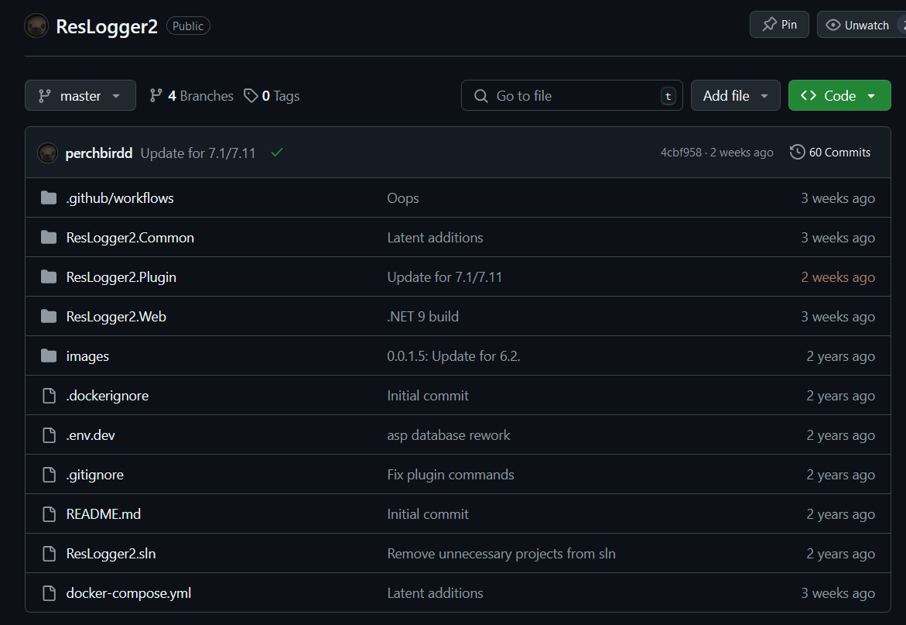
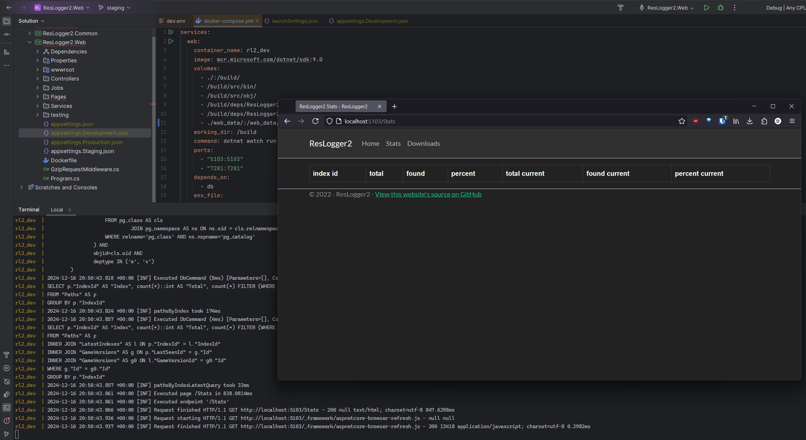
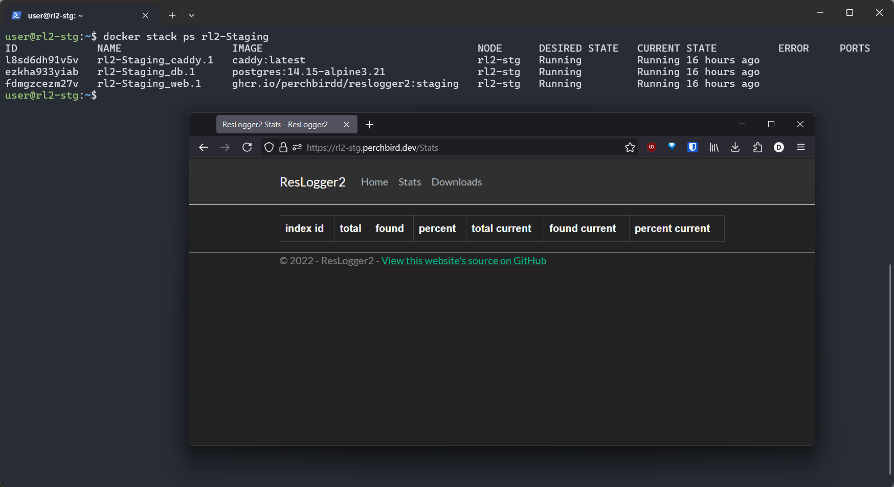
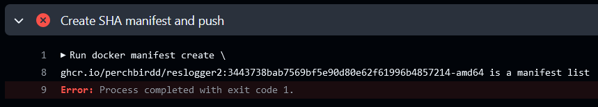
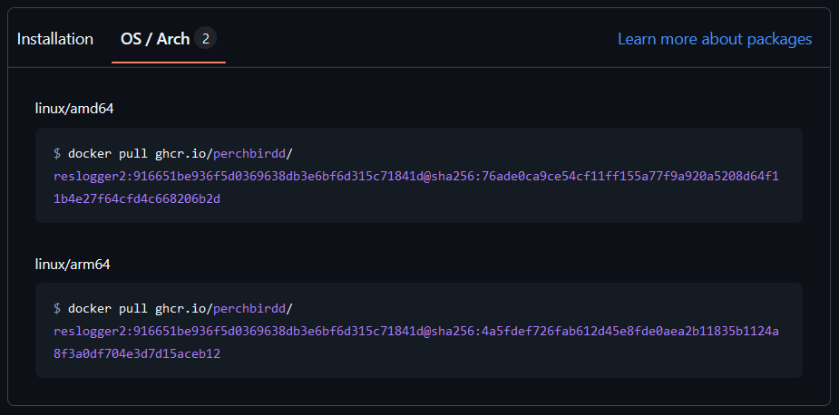

I think one of the founding issues of programming education is that nobody shows you how to ship. There are countless examples, guides, tutorials online about how to use the latest framework to publish a to-do app to Vercel, but very few that show you how to take an application *you didn't think would get so complicated!* and deploy it yourself, automatically, securely, and easily.

# Introduction to ResLogger

I write plugins for Final Fantasy XIV. The game itself has a virtual filesystem of sorts that utilize two file types: index files and dat files. You can think of an index file as a hashmap of file positions. The dat file is where the data actually is. The index file, being a hashmap, rarely stores actual file paths. If the game wants to know where `chara/monster/m0887/obj/body/b0001/model/m0887b0001.mdl` is, the process goes as follows (assuming a retail game install - benchmarks work slightly differently):
1. Split the file path into folder and file parts. That is, `chara/monster/m0887/obj/body/b0001/model` and `m0887b0001.mdl`.
2. Use some simple fallthrough conditionals to determine the "category ID" of the path. This one is in (hex) `040000` because the path starts with `cha`.
3. Hash the folder part and the file part using JAMCRC.
4. Look up the folder CRC in the index file data, then look up the file CRC. Since these are sorted by folder -> file, it's very fast.
5. Obtain the data for this entry. 4 packed bytes contains the data file ID and the block offset.
6. Use the data file ID to determine the data file (`040000.win32.dat0`, `.dat1`, etc) and the offset in the file (block offset * 8).
7. Read the blocks from the data file in Square Enix's very special way.

If you paid attention here, you may be thinking "so they don't store the paths?" No*. They do not. [That has been an industrial strength irritant for over a decade.](https://www.google.com/search?q=ffxiv+explorer+%22hash%22) That means the process of collecting paths is left to the reverse engineers. Unfortunately, not all paths are referenced directly, so you can't just parse them all out from other files like some kind of heathen. Some paths may never be referenced by another file, either hardcoded into the executable like title screen zones, computed at runtime like monster assets, or just not referenced at all like future assets for unreleased content. The unknown and unreleased stuff might be explored in a future post, but the things that the game actually does load can be tracked.

The FFXIV datamining community has long had a Cheat Engine script for this purpose. That script would set a breakpoint at a single hardcoded address and handle the breakpoint using a cheat engine lua function that would write to the output window and to a file. It worked okay, but required Cheat Engine running and attached, required manual updates, and was not very... extensible, I guess you would say. When the Dalamud plugin system came around and I had experience with plugins, I became tired of this silly script and instead wrote a plugin that would do the same thing - but all the time. No matter what you were doing, when you loaded the game, it would begin logging paths, and simply writing them to a text file. This was a good enough replacement at the time. It provided an easy-to-use interface that allowed you to see in real-time which paths were being loaded, and wrote them to a file as well for import into a "hash list database" or other tools.

## ResLogger2

Fast forward a while, and I decided that path collecting could be amplified if it was crowdsourced. I built a small API in Python using Flask and Postgres that would accept a request containing a number of paths, and store it into a database for export later. The difficult part was ensuring that paths actually "existed" - modding was a common pastime in FFXIV, and modders had become privy to the fact that they could technically store their files at *any* file path, and FFXIV would request it as long as it was referenced properly. Client-side validation would still pass, as the main method of modding would outright modify your index files in order to function. This would result in my API being fed game paths that didn't actually exist - poisoned data, so to speak. There's no auth or user validation, so it's not as easy as just removing all paths provided by a specific user. The system needed to read fresh, valid index files on the API side.

I achieved this with extremely simple index file reading code in Python and a bash script to manually sync the index files (remember, that's all we actually need to determine if a path exists) up to the server, which, upon restarting, would read these files into memory for quick "existence" checks. Of course, a free, open-source crowdsourcing service should provide its data freely, so I had a cronjob perform a CSV-format dump of the database every night. This simple deployment consisted of the Python web service hosted directly through Flask and a Postgres server next to it, spun up via [docker-compose](https://github.com/perchbirdd/ResLogger2/blob/5ee4ecc96281f8c8cb9bf14074e5303fa59b7ca5/ResLogger2.Web/docker-compose.yml). In development, this worked... fine for testing, as I could spin up the DB in a container, and run the API directly on my machine for a quick development loop. To deploy, I would switch my shell from PowerShell to WSL2 and run a script that would use rsync to copy all of my source up to the server. On the server, I would SSH in and restart the docker-compose stack by rebuilding the API image directly on the deployment server.

## ASP.NET

I quickly got fed up with uploading index files to the server every. single. patch. Isn't there a way I could do this automatically??? Well, no. There wasn't. I had to wait until a good friend [Lumi](https://bsky.app/profile/lumi.zip) developed [Thaliak](https://thaliak.xiv.dev), which polls XIV login servers and provides an API for checking for updates. At this point, there was already battle-tested code for reading XIV patch files in [XIVLauncher](https://github.com/goatcorp/FFXIVQuickLauncher) (which, coincidentally, Lumi extracted and placed on NuGet), but this was in C#, meaning a rewrite was necessary.

ASP.NET is significantly more complicated than Flask was. While I'm not the most competent Python programmer, Flask was pretty easy to spin up the original API design in. Maybe I'm giving it too much credit, because the system itself became much more complicated when moving to ASP.NET as well.


| Feature | Python | C# |
| --- | --- | --- |
| Path existence | Read index files on startup | Hydrated database with hash components correlated between index1 and index2 |
| Updates | Manually copied index files up to the server | Quartz job performing automatic updates by storing latest game versions in database and checking against Thaliak |
| Path list export | Postgres dump in CSV format | Quartz job performing export in 3 forms, both zipped and gzipped for automated use |
| Visibility | A single link passed around the XIV community | A website with descriptions of the offered export formats, plus code samples for consuming them |
| Logging | docker compose logs? | Seq log forwarding with dashboards and exception notifications to Telegram |

One thing did not change... deployment. Updates to the service were still deployed by rsync'ing all of my code up to the server and re-building the containers. Now I'm tired of that.

# Deployment Shenanigans
## What's the problem?

The setup, as I'm writing this, is as follows. ResLogger2 is a monorepo with a common library, local development tools, the web service, and the Dalamud plugin all in one repository. The plugin deployment is fine, as the automated build system for those is just provided the path to the plugin project. The common repository is fine. Local tools are not committed to the repository, as it has about 3000 lines of testing code to hydrate the original database. I haven't cleaned and committed any of that because the minimum code needed is already implemented in the common library. It's pretty much just a testbed. The web service has two uncommitted appsettings files for ASP.NET configuration, because I didn't want to leak any secrets and I constantly moved from defining them in the appsettings, in the .env file, or directly in the docker compose file. My .env.prod file for production deployment exists only on my Desktop and the server. The docker compose file for production exists only on... the server. I sync this to the server using - you guessed it - an uncommitted bash script that references an SSH key that is once again, only on my Desktop. The state of things is not great.

As of right now, not only can the code on the repository be completely different than the code on the server, but that can also be different than the code on my Desktop. I can only deploy from my Desktop unless I grab the SSH key and sync script and bring them over to another system - another manual process, since they're in .gitignore to once again prevent secrets leaks and to keep the repo clean. This is not even considering actually deploying - rebuilding the container image every single time (this means compiling and publishing the executable for the service) is so obnoxious, and takes up valuable space on layers that the production server should never even need to store. I don't want it to *just work* anymore. I want it to work *well*.

## What do we want?

I knew ResLogger2, as my first web service, was going to be a huge learning experience. I built the client application around the idea that I may need to take the web service down for unknown periods of time for maintenance, troubleshooting, debugging, the growing pains. Web service failures on the client side are almost completely ignored and are completely transparent to the user. It's just crowdsourcing, after all. I am glad I did this. It makes server maintenance much less stressful.

My ideal workflow is as follows: I have the plugin pointing at a local endpoint for development. I would likely restore a production DB backup to the local container for development. I can see a purpose for three different configurations for local development, all with zero friction: DB in container, API locally. DB in container, API in container with hot reload. DB in container, API in container, built in Release like production. This is, in my opinion, the ideal set of development stacks, because things just always go wrong. I constantly find myself trying to figure out why, when running both services in their containers, I can no longer connect to the database, but outside of the container, the API can connect to the database just fine. For actual deployment, I imagine having the ResLogger2.Web repository split out of everything else. I don't care if I have to submodule or NuGet the common library, both are sufficient. I'd like two branches - main for production, `stg` for builds that should be deployed to production-like environments for testing and verifying service startup and basic functionality. `stg` deploys every commit. `main` deploys commits tagged with a version number, and makes a release. Certificates are handled automatically on both environments. There are no extraneous files inside the repository. No bash scripts to run. No mission-critical files are in .gitignore for fear of leaking something important.

I think that's a reasonable goal.

## Getting Started

The first thing that needs to be handled is local development. I think we'll need multiple compose files in order to do what we're looking to do. However, the repository needs some handling first.



I'm going to go with this setup:
```
perchbirdd GitHub
├─ ResLogger2.Common
├─ ResLogger2.Plugin
│  ├─ ResLogger2.Common
├─ ResLogger2.Web
│  ├─ ResLogger2.Common
```
When there's an update pushed to common, just update the submodule and push that. I think we can close the book on ResLogger2.Common for now.

The next thing to handle is appsettings.json. Here are the current versions of those files:

`appsettings.Development.json`
```json
{
  "Kestrel": {
    "EndPoints": {
      "Http": {
        "Url": "http://*:5103"
      },
      "Https": {
        "Url": "http://*:7281"
      }
    }
  },
  "ExportDirectory": "testing/live/",
  "BackupDirectory": "testing/"
}
```

`appsettings.json`
```json
{
  "Kestrel": {
    "EndPoints": {
      "Http": {
        "Url": "http://*:80"
      },
      "Https": {
          "Url": "https://*:443"
      }
    }
  },
  "LettuceEncrypt": {
    "AcceptTermsOfService": true,
    "DomainNames": [ "rl2.perchbird.dev" ],
    "EmailAddress": "[omitted]"
  },
  "Serilog": {
    "Using": [ "Serilog.Sinks.Console", "Serilog.Sinks.File" ],
    "MinimumLevel": {
      "Default": "Debug",
      "Override": {
        "Microsoft.EntityFrameworkCore": "Warning",
        "Microsoft.AspNetCore": "Warning",
        "Quartz.Core": "Warning"
      }
    },
    "WriteTo": [
      {
        "Name": "Console",
        "Args": {
          "outputTemplate": "{Timestamp:yyyy-MM-dd HH:mm:ss.fff zzz} [{Level:u3}] {Message:lj}{NewLine}{Exception}"
        }
      },
      {
        "Name": "File",
        "Args": {
          "path": "/usr/src/app/persistence/web/logs/log-.txt",
          "rollingInterval": "Day",
          "outputTemplate": "{Timestamp:yyyy-MM-dd HH:mm:ss.fff zzz} [{Level:u3}] {Message:lj}{NewLine}{Exception}"
        }
      },
      {
        "Name": "Seq",
        "Args": {
          "serverUrl": "http://logs.perchbird.dev:5341",
          "apiKey": "[omitted]"
        }
      }
    ],
    "Enrich": [ "FromLogContext" ],
    "Properties": {
      "Application": "ResLogger2"
    }
  },
  "AllowedHosts": "*",
  "ExportDirectory": "/usr/src/app/persistence/web/live/",
  "BackupDirectory": "/usr/src/app/persistence/web/",
  "CertDirectory": "/usr/src/app/persistence/web/cert/"
}
```

Maybe you can see why I didn't want to commit this guy! As you can see, it needs to access a few directories. These are mapped to the host, not volumes, in the docker-compose:

`docker-compose.yml`
```yml
version: '3.8'

services:
  web:
    build:
      context: .
      dockerfile: ResLogger2.Web/Dockerfile
    volumes:
      - ./deploy/persistence/web/:/usr/src/app/persistence/
    ports:
      - "5103:5103"
      - "7281:7281"
    env_file:
      - ./.env.dev
    depends_on:
      - db
  db:
    image: bitnami/postgresql:14.6.0
    user: "1002"
    ports:
      - "5432:5432"
    volumes:
      - ./deploy/persistence/db/:/bitnami/postgresql
    env_file:
      - ./.env.dev
```

It references `.env.dev`:
```a
COMPOSE_PROJECT_NAME=rl2dev
ASPNETCORE_ENVIRONMENT=Development
POSTGRESQL_USERNAME=rl2
POSTGRESQL_PASSWORD=rl2
PGPASSWORD=${POSTGRESQL_PASSWORD}
POSTGRESQL_DATABASE=rl2
POSTGRESQL_HOST=db
POSTGRESQL_PORT=5432
RL2_CONNSTRING=Host=${POSTGRESQL_HOST}:${POSTGRESQL_PORT};Database=${POSTGRESQL_DATABASE};Username=${POSTGRESQL_USERNAME};Password=${POSTGRESQL_PASSWORD}
TZ=America/New_York
```

Note that the production docker-compose (`docker-compose.prod.yml`) is the exact same, except it references `.env.prod`, which is the exact same as `.env.dev`, except it has the production database password in it. In reality, there is absolutely nothing sensitive about a bunch of file system paths for a video game, but I'm trying to learn here.

### The Testcontainers Experiment

I've always wanted to try out Testcontainers, but I don't have any tests at all for my personal projects. So instead of writing tests for Testcontainers, I was thinking to just use Testcontainers at runtime! My idea was this: rather than having to configure, maintain, and run yet another docker compose file for API-outside-of-container development, I could just spin up and shut down postgres *with the application* using Testcontainers:

```cs
if (app.Environment.IsDevelopment())
{
	app.UseSwagger();
	app.UseSwaggerUI();
	
	var pgVolume = new VolumeBuilder()
		.WithName("pg_data")
		.WithReuse(true)
		.Build();

	var pg = new PostgreSqlBuilder()
		.WithDatabase("rl2")
		.WithUsername("rl2")
		.WithPassword("rl2")
		.WithPortBinding(5432, 5432)
		.WithVolumeMount(pgVolume, "/var/lib/postgresql/data")
		.WithWaitStrategy(Wait.ForUnixContainer().UntilMessageIsLogged("database system is ready to accept connections"))
		.Build();
	
	await pg.StartAsync().ConfigureAwait(false);
}
```

This worked great, actually. I temporarily set up a bind mount and restored from a production database backup. I got a few errors - expected, as I didn't drop the database, and EF Core had already created everything for me when booting the application. I didn't spend too much time here. Despite the success, I feel that it's both too coupled and too de-coupled. Too coupled to the application, and too de-coupled from the rest of the so-called infrastructure. However, knowing that Testcontainers works flawlessly even outside of tests is a great strategy for super-quick iteration I'll probably use in the future.

## Back to it

So... what's the best path forward?  For local development, I think we can do something like so:
- Remove all non-defaults from `launchsettings.json`. This is used when launching the application from an IDE or on the development machine. It also complicates things, as it is yet another place to specify a set of variables that can impact how the application runs.
- Rely on the user for local development. Who really cares if you need to spin up a container with `docker compose up db` once every development session? This way, we can use the same compose file for local development with and without containers, and have a separate docker stack file for automated deployments.
- Implement heavy use of appsettings and environment variables for environment controls. Let's be real - the development environment doesn't need log aggregation or certs. But it will require an export directory and a backup directory for proper execution. We can take advantage of appsettings inheritance, ASP.NET environments, and environment variables to streamline the configuration between local-out-of-container, local-in-container, staging, and production. Automated deployments will use docker swarm/stack - and thus we can use configs and secrets for those.

Let's start with docker. We can modify our existing docker containers (which use rootless bitnami) to use the standard postgres container. Let's set the development docker-compose up so that it also hot-reloads the web service as it changes. 

```yml
services:
  web:
    container_name: rl2_dev
    image: mcr.microsoft.com/dotnet/sdk:9.0
    volumes:
      - ./:/build/
      - /build/src/bin/
      - /build/src/obj/
      - /build/deps/ResLogger2.Common/src/obj/
      - /build/deps/ResLogger2.Common/src/bin/
      - ./web_data/:/web_data/
    working_dir: /build
    command: dotnet watch run --project src/ResLogger2.Web.csproj
    ports:
      - "5103:5103"
      - "7281:7281"
    depends_on:
      - db
    env_file:
      - Development.env

  db:
    image: postgres:14.15-alpine3.21
    ports:
      - "5432:5432"
    volumes:
      - pg_data:/var/lib/postgresql/data/
    env_file:
      - Development.env

volumes:
  pg_data:
```

with the `Development.env` file:

```env
DOTNET_ENVIRONMENT=Development
POSTGRES_USER=rl2
POSTGRES_PASSWORD=rl2
RL2_CONNSTRING=Host=db:5432;Database=rl2;Username=${POSTGRES_USER};Password=${POSTGRES_PASSWORD}
```

This runs both services with live code changes, as containers in Docker. Note that we're mapping the current directory to /build/ in the container - this is what drives the hot reload. We're also mapping some directories as volumes that we have on both the host and the container, and you might wonder why. Dotnet will place some platform/system-specific files into `obj` and `bin` that assist in building the application. These files also assist IDEs with analysis and other things that I don't know of. But what I do know is that the files places into these folders by the container are 1. unnecessary for us on Windows, and 2. break our view of the source code on the host. So, we simply map them as a volume, kind of to say, "I know this is inside of a folder I've already mapped, but just kinda ignore that guy." Finally, we have a web_data bind mount that we can use inside `appsettings.Development.json`:
```json
{
  "Kestrel": {
    "EndPoints": {
      "Http": {
        "Url": "http://*:5103"
      }
    }
  },
  "ExportDirectory": "/web_data/export/",
  "BackupDirectory": "/web_data/backup"
}
```

This way the containerized, hot-reloading application will plop its output (from export and backup) into the host filesystem, so we don't have to copy stuff out of the container if we need to examine the output.

And with just a single `docker compose up` - we have our application stack running:



The stats page displaying properly showcases that database access is available. There's no data, so the table is empty, but the connection is working. The only thing I'm not completely happy with is the speed and workflow of dotnet watch from within the docker container. I may experiment with docker watch at some point, but this is perfectly usable for now. Let's move on to deployment.

## Preparing for Deployment

Since we want our automation to handle the deployment from just a commit, we'll want to make sure our application code is sound prior to even bothering to deploy. We'll start with a simple compile workflow that's required for all other jobs.

```yml
  compile:
    runs-on: ubuntu-latest
    steps:
      - name: Checkout repository
        uses: actions/checkout@v4
        with:
          submodules: recursive
      - name: Setup dotnet
        uses: actions/setup-dotnet@v4
        with:
          dotnet-version: '9.x.x'
      - name: Restore
        run: dotnet restore
      - name: Compile
        run: dotnet build --no-restore --configuration Release
```

Easy enough. If this job fails, the rest of the jobs won't even run as long as we specify their dependency properly. Let's build the image... oh, wait. We didn't discuss our Dockerfile.

`Dockerfile`
```Dockerfile
FROM mcr.microsoft.com/dotnet/aspnet:9.0 AS base
WORKDIR /app
EXPOSE 80
EXPOSE 443

FROM mcr.microsoft.com/dotnet/sdk:9.0 AS build
WORKDIR /build
COPY ../src src
COPY ../deps deps
RUN dotnet publish "src/ResLogger2.Web.csproj" -c Release -o /app/publish

FROM base AS final
ENV TZ=America/New_York
WORKDIR /app
COPY --from=build /app/publish .
ENTRYPOINT ["dotnet", "ResLogger2.Web.dll"]
```
A simple multi-stage build. We use `dotnet/sdk` and copy in `src` and `deps`. Both ResLogger2.Web and ResLogger2.Common's `bin` and `obj` folders are in the `.dockerignore` file, so they're ignored under all circumstances - this keeps the build fast since no transfer takes place. Oh yeah, and we also have `web_data` in there, so any files from testing won't be copied to the context either. Anyways, we copy our source in, `dotnet publish` it, and copy this directory to the final image, based on `dotnet/aspnet`. This keeps the image small. It is currently 270MB - considering the `dotnet/aspnet` image itself is 223MB, this is acceptable to me.

Moving on to build inside the action! Wait a second, we don't want to tag an image for staging with `latest`... and we don't want to deploy the `latest` image, probably built from `main`, to staging... So we have to generate the tag beforehand. Unfortunately, we also need to compute the environment in a roundabout way, as we only want `staging` commits to deploy to `staging`, and `main` commits to deploy to `production`. I wanted `main` to only deploy to production when tagged with a version, but it would be an utter nightmare to try to determine "is this action running due to a push of a tag onto main?" so I ditched that desire. Here's the action `identify` that sets some vars for later:

```yml
  identify:
    runs-on: ubuntu-latest
    steps:
      - name: Checkout
        uses: actions/checkout@v2
        with:
          fetch-depth: 0
      - name: Set deployment environment
        id: identify_env
        run: |
          if [[ "${{ github.ref_name }}" == "main" && "${{ github.ref_type }}" == "branch" ]]; then
            echo "environment=Production" >> $GITHUB_OUTPUT
            echo "image_tag=latest" >> $GITHUB_OUTPUT
          elif [[ "${{ github.ref_name }}" == "staging" && "${{ github.ref_type }}" == "branch" ]]; then
            echo "environment=Staging" >> $GITHUB_OUTPUT
            echo "image_tag=staging" >> $GITHUB_OUTPUT
          else
            echo "environment=None" >> $GITHUB_OUTPUT
            echo "image_tag=None" >> $GITHUB_OUTPUT
          fi
    outputs:
      environment: ${{ steps.identify_env.outputs.environment }}
      image_tag: ${{ steps.identify_env.outputs.image_tag }}
```

Now we can move on:
```yml
  push-image:
    runs-on: ubuntu-latest
    needs:
      - compile
      - identify
    steps:
      - name: Checkout repository
        uses: actions/checkout@v4
        with:
          submodules: recursive
      - name: Log in to the Container registry
        uses: docker/login-action@v3
        with:
          registry: https://ghcr.io
          username: ${{ github.actor }}
          password: ${{ secrets.GITHUB_TOKEN }}
        uses: docker/build-push-action@v6
        with:
          file: ./src/Dockerfile
          context: .
          push: true
          tags: |
            ghcr.io/perchbirdd/reslogger2:${{ needs.identify.outputs.image_tag }}
            ghcr.io/perchbirdd/reslogger2:${{ github.sha }}
```

This will build the image and push it to the GitHub container registry with the tag of `staging` if the job is run from a commit to `staging`, or `latest` if the tag is run from a commit to `main`.

Here's where things get dicey. Here was the original plan:
- Set environment secrets and variables on the GitHub UI. That is, username, hostname, database password, log aggregator API key.

In the action,
1. Log in to Tailscale
2. SSH (thanks to Tailscale) into ${{ vars.ENV_USER }}@${{ vars.ENV_HOSTNAME }}
3. Place some files onto the filesystem? The docker-compose? The .env file... ?
4. docker compose up! but remotely
5. Everyone is happy

### Tailscale didn't like me for a while

I love Tailscale. I really do. I thought it would be perfect for this CI. Spin up an ephemeral runner with an auth key. Connect to Tailscale. Connect to the host to deploy to. But I went down an hours-long rabbit hole just trying to get SSH to work.

From the action, `tailscale ssh user@rl2-stg` worked fine. But `ssh user@rl2-stg` provided me with the dreaded `Host key verification failed.` every time. I was planning on utilizing some functionality that I wouldn't be able to use `tailscale ssh` for specifically, so this was a problem. It took me a number of hours to come up with the following actions step which allows `ssh` to function to other tailscale nodes:

```yml
- name: Configure SSH
  run: |
    mkdir -p ~/.ssh
    chmod 700 ~/.ssh
    cat <<EOF >> ~/.ssh/config
    Host ${{ vars.ENV_HOSTNAME }}
        User ${{ vars.ENV_USER }}
        Hostname ${{ vars.ENV_HOSTNAME }}
        StrictHostKeyChecking no
        UserKnownHostsFile=/dev/null
    EOF
    chmod 600 ~/.ssh/config
```

"Many hours? This is simple stuff, perch!" you might say. Yes. It is simple stuff. However, while testing this out, I learned about *tags* in Tailscale for the first time. I had to, as they're a requirement for a lot of the automation and permissions stuff. What I didn't know is that tagging a node *removes you as the owner*, your ACLs *might not permit the admin to connect to them anymore*, and to un-tag the node *you have to log in and re-auth the node*. See where this is going? So I had to detour for a while and learn just enough Tailscale ACL configuration to be able to SSH back into the server I tagged. Yes, I could have just SSHed in and re-auth'd, but I don't permit any connections from the internet on port 22 on any of my VPS machines, so I'd have to go into the cloud provider's panel and add the rule back and... now that I think about it, maybe that would have been the easier way. Whatever.

## Waiter, more Context, please!

Here's the deploy job:

```yml
deploy:
  runs-on: ubuntu-latest
  needs: [compile, identify, push-image]
  environment: ${{ needs.identify.outputs.environment }}
  concurrency: deploy-${{ needs.identify.outputs.environment }} 
  steps:
    - name: Checkout repository
      uses: actions/checkout@v4
    - name: Set Deployment Environment
      id: deployment_env
      run: |
        if [[ "${{ needs.identify.outputs.environment }}" == "None" ]]; then
          exit 1
        else
          echo "environment=${{ needs.identify.outputs.environment }}" >> $GITHUB_ENV
        fi
    - name: Connect to Tailscale
      uses: tailscale/github-action@v2
      with:
        oauth-client-id: ${{ secrets.TS_OAUTH_CLIENT_ID }}
        oauth-secret: ${{ secrets.TS_OAUTH_SECRET }}
        tags: tag:ci
        args: --ssh
    - name: Configure SSH
      run: |
        mkdir -p ~/.ssh
        chmod 700 ~/.ssh
        cat <<EOF >> ~/.ssh/config
        Host ${{ vars.ENV_HOSTNAME }}
            User ${{ vars.ENV_USER }}
            Hostname ${{ vars.ENV_HOSTNAME }}
            StrictHostKeyChecking no
            UserKnownHostsFile=/dev/null
        EOF
        chmod 600 ~/.ssh/config
    - name: Hydrate env file
      run: |
        source $environment.env
        echo "POSTGRES_PASSWORD=${{ secrets.DB_PASS }}" >> $environment.env
        echo "RL2_CONNSTRING=Host=db:5432;Database=rl2;Username=${POSTGRES_USER};Password=${{ secrets.DB_PASS }}" >> $environment.env
        echo "Serilog__WriteTo__1__Args__apiKey=${{ secrets.SEQ_API_KEY }}" >> $environment.env
    - name: Deploy with Docker Stack
      run: |
        docker context create remote --docker "host=ssh://${{ vars.ENV_USER }}@${{ vars.ENV_HOSTNAME }}"
        docker context use remote
        docker stack deploy -c docker-stack.$environment.yml rl2-$environment
```

So, what are we doing?
1. Ensure we've completed the steps `compile`, `identify`, and `push-image`
2. Set the environment using the output of `identify`
3. Set the concurrency level using a label unique to each environment, so we don't try to deploy twice at the same time
4. Fail fast if we somehow don't have a deployment environment set properly
5. Checkout the repository
6. Log in to Tailscale using repository secrets
7. Configure SSH to bypass host key verification
8. Place secrets that the runner has access to into the .env file for the provided environment
9. Add a `docker context` and set it as the current context, and finally, `docker stack deploy` with the environment's stack file and the environment's name. It's done!

Step 8 and 9 are the most interesting to me. In order to keep the repository clean and still be able to commit every file necessary for a deployment, we hydrate the env file with secrets on the runner, accessible by the runner. We also source the env file first, because *docker stack does not interpolate vars in env files!* You might say, "you're using docker swarm/stack anyways, so why not use `secrets`? And the answer is that secrets are a file. That kind of sucks. I would have to modify the application in a very odd way to support it. I get why, it just doesn't work well for the technologies I'm using. There may be a more idiomatic docker way to get ASP.NET to utilize the stack secrets, but maybe I'll do that another time.

Finally, I've set up DNS to point rl2-stg.perchbird.dev to the appropriate address and added Caddy to the stack to handle HTTPS and reverse proxying to the web service:

`docker-stack.Staging.yml`
```yml
services:
  
  caddy:
    image: caddy:latest
    ports:
      - "80:80"
      - "443:443"
    volumes:
      - caddy_data:/data
      - caddy_config:/config
    command: "caddy reverse-proxy --from rl2-stg.perchbird.dev --to http://web:80"
  
  web:
    image: ghcr.io/perchbirdd/reslogger2:staging
    volumes:
      - web_data:/web_data/
    env_file:
      - Staging.env
    depends_on:
      - db

  db:
    image: postgres:14.15-alpine3.21
    ports:
      - "5432:5432"
    volumes:
      - pg_data:/var/lib/postgresql/data/
    env_file:
      - Staging.env

volumes:
  web_data:
  pg_data:
  caddy_data:
  caddy_config:
```

The stack is very simple. I've gotten pretty much where I want everything to be with this setup:



With just a commit to staging, I can ensure my code compiles properly, build and push a Docker image, and deploy to either environment, Staging or Production. There are no uncommitted latent files in the repository, nor are there any secrets being committed. I can clone the repo on a fresh machine, and as long as I can log into GitHub, I can redeploy the service. I also don't even have to run the service locally - I can work out of Staging and have CI deploy my changes, since it only takes a minute or two. Docker Swarm mode gives us a number of cool features. We aren't using configs or secrets in this stack (yet?) but we do get rolling deployments and rollback for free. The stack will continue using healthy containers until the new deployment's containers are healthy, and we can rollback a service to the previous deployment with a single command. And finally, we can add replication and clustering to the stack with practically zero effort if we want.

I am very happy with this!

## ARMed and Dangerous

There is one fatal flaw here: ResLogger2's production system is a free *arm64* VPS running on Oracle Cloud. The images that CI is producing are built only for amd64. Thankfully, resolving this is easy. We just add two steps to set up QEMU and buildx before building the image, then we add `platforms: linux/arm64,linux/amd64` and we're all set...


Oh no. This is going to be an entire other thing, huh.

It seems like many others have encountered this exact thing, and switched to... running build matrices? I mean, running them at the same time could save maybe 2 minutes, but the time consumer is not "please run these at the same time", it's the process of creating the image (from what I can tell). I don't really understand how others are building complex images in 45 minutes, but that is not a problem for me to solve right now. It seems that a number of people build disparate images with architecture tags, then combine them into a tagged manifest that contains both. This works if you're running the builds at the same time via matrices, but it also works for *multiple builds on separate runners*. Huh. Where do I know where I can get an arm64 machine with plenty of processing power to spare for a self-hosted runner? [Oh, right!](#armed-and-dangerous)

So, I set up the GitHub runner script on the ResLogger2 production system [much to GitHub's dismay.](https://docs.github.com/en/actions/security-for-github-actions/security-guides/security-hardening-for-github-actions#hardening-for-self-hosted-runners) I'll probably do a follow-up on this either transforming the action or hardening the runner further - both would be entertaining in my opinion. For now, since I don't expect many, if not any pull requests, I have set the actions on this repository to prevent any workflow runs without approval. Regardless, I can now run two jobs, one on GitHub's runners, one on my own, that create images for their respective architectures. Thankfully, that's all we need to do- oh.



So, it looks like some change that they made with how the `docker/build-push-action` creates/pushes images. We have to turn `provenance: false`. If I were doing something important, I would find another way around this. But since this is a hobby project intended for myself to use and run, I don't mind turning off this option. But remember: SBOM, provenance, and attestation is very useful. That being said,



There we go!

## Finalizing it

Let's get production ready. Currently, ResLogger2 runs a docker compose setup. We can take down the compose completely, then bring up the db service to run an export.

```_
ubuntu@main:~/app$ docker-compose -f docker-compose.prod.yml -p rl2 down --remove-orphans
[+] Running 3/3
 ⠿ Container rl2-web-1  Removed                                                                   0.3s
 ⠿ Container rl2-db-1   Removed                                                                   0.2s
 ⠿ Network rl2_default  Removed                                                                   0.2s
ubuntu@main:~/app$ sudo docker compose -f /home/ubuntu/app/docker-compose.prod.yml -p rl2 up db -d
[+] Running 1/1
 ✔ Container rl2-db-1  Started                                                                    0.2s
ubuntu@main:~/app$ sudo docker compose -f /home/ubuntu/app/docker-compose.prod.yml -p rl2 exec db pg_dump -U rl2 -F t -f /db_backup/db.backup
ubuntu@main:~/app$ ls deploy/persistence/db_backup/
db.backup
```

Now that we have an export ready, we can take down this compose entirely. I've moved the entire contents here from `app` to `app_old` for temporary safekeeping. Let's attempt a production deployment. We do everything the exact same, but slightly adjust the compose stack for production by referencing the `Production.env` file and changing the url passed to Caddy. We also add a new `pg_backup` volume for transfer in and out of the container - we can restore our database backup through here as well as take backups out from here. I back up the ResLogger2 database dump every day.

Once it's deployed (Hooray! Our stack works not only in Production but on arm64!), we can begin the restoration. I've blocked incoming traffic so the web service can sit in peace while we prep the database.

Copy the backup into the container and restore it:
```_
ubuntu@main:~$ docker cp db.backup rl2-Production_db.1.njzjdiyym6nyh0hkw6pcgsyku:/pg_backup
Successfully copied 235MB to rl2-Production_db.1.njzjdiyym6nyh0hkw6pcgsyku:/pg_backup
ubuntu@main:~$ docker exec -it rl2-Production_db.1.njzjdiyym6nyh0hkw6pcgsyku "/bin/sh"
/ # dropdb -f rl2 -U rl2
/ # createdb -U rl2 -W rl2
Password:
/ # pg_restore -U rl2 -d rl2 /pg_backup/db.backup
```

And the database is back, and the stats page populates without a problem. There was a slight issue due to some config changes I made regarding the file-serving path inside of the container, but that was my fault. I updated the output path inside the container to remove a subfolder, but didn't change the links on the download page. Oops!

# Conclusion

What did we learn here?

- How to commit everything to a repository without exposing secrets
- How to take advantage of GitHub's Actions and Container Registry for free for hobby projects (thanks, GitHub!)
- How to build a multi-arch image in GHA without taking 70 years, provided you have an arm64 system available and [don't mind using self hosted runners](https://docs.github.com/en/actions/hosting-your-own-runners/managing-self-hosted-runners/about-self-hosted-runners#self-hosted-runner-security)
- How to use some neat Docker features for things like remote deployments, rolling deploy and rollbacks, and future proofing (clustering, replication, configs, secrets)

I would love to improve on this over time. However, I currently have a few other projects taking up valuable mind space, and I've spent too long on this for my brain to continue to focus. You can view the results of this project at [https://github.com/perchbirdd/ResLogger2.Web](https://github.com/perchbirdd/ResLogger2.Web). This post and project was heavily inspired by [this video by Dreams of Code.](https://www.youtube.com/watch?v=fuZoxuBiL9o) If you have comments or desperately need to tell me I'm wrong about something, my contact info is in the About section up top. Thanks for reading!